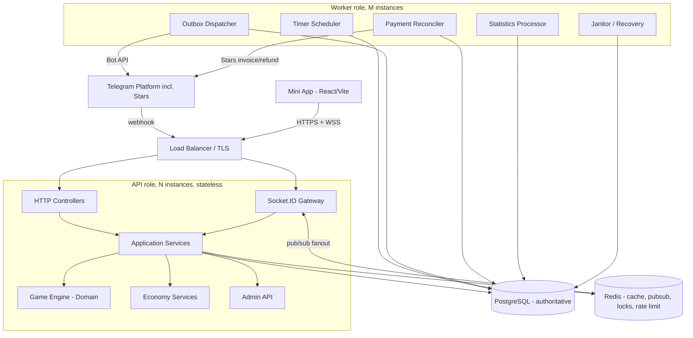
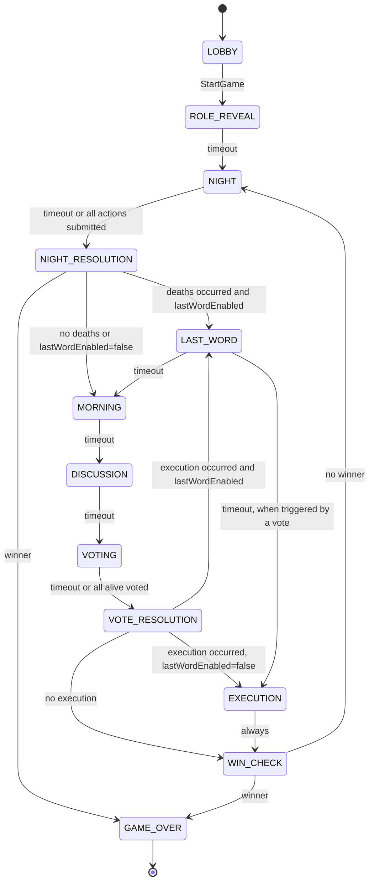

# 1. Document Control

| Field | Value |
|---|---|
| Document title | REAL MAFIA — Master Technical & Product Specification |
| Document ID | RM-MASTER-TZ |
| Version | **6.0** (supersedes 5.0) |
| Status | Authoritative Master Specification — Implementation Contract |
| Product | REAL MAFIA — Telegram Mini App multiplayer social-deduction platform |
| Primary surface | Telegram Mini App (gameplay); Telegram Bot (entry point, notifications, payments) |
| Backend | NestJS + TypeScript (modular monolith) |
| Frontend | React + TypeScript + Vite |
| Database | PostgreSQL 15+ / Prisma |
| Realtime | Socket.IO + Redis adapter |
| Payments | Telegram Stars (native Bot Payments API, currency `XTR`) |
| Languages | Uzbek (default), Russian, English |
| Canonical path | `docs/00-master/MASTER_TZ.md` |

## 1.1 Authority hierarchy

Unchanged from v5.0 (§1.1): Open Decision > this Master Specification > ADR > Domain/State Machine spec > API/Realtime contract > implementation detail > developer/agent preference. Undefined behavior must never be invented; it must be raised as an Open Decision.

## 1.2 Requirement language

Unchanged: **MUST** (mandatory for V1), **SHOULD** (deferrable with an approved ADR), **MAY** (optional). Vague wording is prohibited.

## 1.3 Change log (v5.0 → v6.0)

This is a product-scope revision, not a patch. The following decisions were made by the product owner and are now binding (no longer Open Decisions):

| # | Change | Effect |
|---|---|---|
| C6-01 | **Discussion moves entirely into the Mini App.** The Telegram group is no longer the social layer. In-app text chat (public, dead-only, mafia-night) replaces it. | New subsystem §18; OD-025/OD-030(v5) resolved differently than assumed. |
| C6-02 | **Group binding replaced by a Room model.** A game is no longer scoped to one Telegram group. Players join a Room by code, deep link, or a public room browser. | Rewrites §7 (Actors), §9 (lifecycle scoping), §13, §31 (launch context). |
| C6-03 | **Role catalogue expanded to 9 roles across 3 teams** (TOWN, MAFIA, NEUTRAL): Civilian, Detective, Sheriff, Doctor, Bodyguard, Journalist, Mafia, Don, Maniac. | Rewrites §11, §15, §17, win evaluator. |
| C6-04 | **Player count 4–24**, with a fixed role-distribution table supplied by the product owner. **MVP ships 4–12**; the engine and schema are built for the full range from day one so 13–24 is a config change, not a rewrite. | §12. |
| C6-05 | **No pay-to-win items.** Explicitly rejected: any purchasable effect that changes match outcome (fake investigation results, purchasable extra protection, etc.). All monetized content is cosmetic-only. | Governs §24, invariant I-33. |
| C6-06 | **Subscription model dropped.** No recurring payment, no player-count paywall. All room sizes are free. | Removes v5 OD "subscription" framing entirely. |
| C6-07 | **Dual-currency economy**: soft currency **Pul** (💵, earned by playing, spent on standard cosmetics) and hard currency **Olmos/Diamonds** (💎, purchased with Telegram Stars, spent on premium/ultra cosmetics and exchanged 💎→💵 one-way). | New §23–24. |
| C6-08 | **Three-tier cosmetic pricing**: STANDARD (💵 or 💎), PREMIUM (💵 or 💎, steep soft-currency ratio), ULTRA (💎-only). Every price is admin-configurable per item. | §24.2. |
| C6-09 | **Telegram Stars is the exclusive payment rail** (Telegram platform policy for digital goods sold inside Telegram apps — no card, no external processor for in-app currency). | New §25. |
| C6-10 | **Referral system**: reward fires on the invited friend's **first completed game**, not on signup; decaying reward tiers by lifetime invite count (no hard cap); self-referral and duplicate-source-account referral blocked at the data-model level. | New §26. |
| C6-11 | **SuperAdmin Panel**: full runtime control of prices, reward tiers, role distribution, phase durations, ruleset versioning, content (cosmetic assets), moderation, and dashboards — without a deployment. | New §28. |
| C6-12 | **Localization is MUST, not SHOULD**: Uzbek, Russian, English, with automatic detection from Telegram `language_code` and manual override. | New §27. |
| C6-13 | **Fast Mode** ruleset variant (shorter phase durations) alongside Normal Mode, selectable by the room host at creation. | §12.3. |

Everything from v5.0 not listed above is **retained unchanged**: the transactional concurrency model, idempotency model, event architecture, outbox pattern, timer infrastructure, reconnect protocol, security controls, observability, testing strategy shape, deployment topology, and all 32 architectural invariants (renumbered/extended in §53). This document is self-contained; v5.0 is superseded in full.

## 1.4 Open Decisions closed by this revision

OD-016 (role distribution), OD-017 (phase durations, Normal + Fast), OD-005 (doctor stacking — now resolved per the full role table), OD-025 (mafia reveal — resolved as immediate, §15.4), and the monetization framing are all closed. The remaining v5 Open Decisions (OD-002 mafia kill policy is now resolved by the Don mechanic, OD-013 host transfer, OD-014 readiness, OD-015 disconnect, OD-018 tie policy, OD-019 detective semantics, OD-020 vote visibility, OD-022 dead visibility, OD-023 host powers, OD-024 role reveal, OD-027 first-night kill, OD-028 action changes, OD-029 room expiry) carry forward and are restated in §49 with updated context.

---

# 2. Executive Summary

REAL MAFIA is a Telegram Mini App social-deduction game for 4–24 players (MVP: 4–12), played **entirely inside the Mini App**. The Telegram Bot is the entry point (deep links, notifications, Stars payments) and never the gameplay surface. A player creates a **Room**, shares its code or link (through any channel — Telegram chat, other apps, or REAL MAFIA's own public room browser), and up to 24 players join. Roles are assigned across three teams — Town, Mafia, Neutral (Maniac) — from a fixed distribution table. Discussion happens in an in-app chat with public, dead-only and mafia-night channels, each strictly access-controlled server-side.

The game engine, concurrency model, durability guarantees and privacy architecture are unchanged from v5.0: PostgreSQL is the sole gameplay authority, every state-changing command executes inside one transaction holding a row lock on the Room/Game, Redis and WebSocket are non-authoritative, and Telegram delivery is an at-least-once side effect. What is new in v6.0 is layered around that same core: a chat subsystem, a dual-currency economy with a cosmetics store, Telegram Stars payments, a referral program, a SuperAdmin panel, and full localization — none of which are permitted to touch match-affecting state. **No purchase, gift, or referral reward may change a game's outcome.** This is invariant I-33 and is treated with the same severity as privacy leakage.

---

# 3. Product Scope

## 3.1 In scope for V1 (MVP)

Telegram authentication; Room creation, join by code/link/public browser; 4–12 players (engine built for 4–24, gated at 12 in the client for MVP, raisable by SuperAdmin without a deploy); host; ready/unready; game start; server-side cryptographic role assignment across 9 roles / 3 teams; role privacy; in-app chat (public, dead, mafia-night); night phase and resolution; morning; discussion; voting; execution; 3-team win detection; game completion; reconnect and recovery; WebSocket realtime; Telegram Bot notifications via outbox; dual-currency wallet (Pul + Diamonds); cosmetics store (3 tiers); Telegram Stars payment integration; referral program; SuperAdmin panel; localization (uz/ru/en); Normal and Fast rule modes; persistent immutable history; statistics; restart recovery; duplicate-request protection; per-room concurrency isolation; production observability, security and tests.

## 3.2 Explicitly out of scope for V1

Subscriptions of any kind; any purchasable item that changes match outcome; 13–24 player rooms in the shipped client (engine-ready, UI-gated); tournaments; clans; matchmaking/skill-based pairing; friendship graph; spectator mode beyond dead-player visibility (OD-022); voice/video chat; AI-controlled players; user-generated rulesets or scripting; NFTs or blockchain assets; crypto payment rails (Stars only, per platform policy — §25.1); more than 3 shipped languages.

---

# 4. Goals and Quality Attributes

Unchanged core goals from v5.0 §4 (G-01 server authority, G-02 isolation, G-03 crash safety, G-04 privacy, G-05 recoverability, G-06 AI-implementability), plus:

| ID | Goal | Measurable acceptance |
|---|---|---|
| G-07 | Fair monetization | Automated test suite proves no purchasable or referral-granted entity appears in any domain validation path (action, vote, resolution, win evaluator). |
| G-08 | Payment correctness | Every Stars transaction is exactly-once reconciled against Telegram's `successful_payment` payload; no double credit under retry or duplicate webhook delivery. |
| G-09 | Admin safety | Every SuperAdmin mutation is audited, versioned, and never alters a game already in progress. |
| G-10 | Localization completeness | 100% of user-facing strings and bot messages resolve in uz/ru/en with no missing-key fallback to a raw key string. |

---

# 5. Actors

Carried over from v5.0 §5 (User, TelegramAccount, Game, GamePlayer, Host, Bot, Operator/Admin, System/Worker), with these changes:

| Actor | Change from v5.0 |
|---|---|
| **Room** | New. Replaces `TelegramGroup` as the binding context for a `Game`. A Room is created by a User, has a `code` and a `visibility` (`PRIVATE` — code/link only, or `PUBLIC` — listed in the room browser), and owns exactly one active `Game` at a time (§9). |
| **TelegramGroup** | Demoted to optional metadata. A Room MAY be linked to a group only for the bot's `/newroom`-style deep-link convenience; no gameplay authorization depends on group membership any more. |
| **Wallet** | New. One per User: `pulBalance`, `diamondBalance`, both ≥ 0, mutated only through audited ledger entries (§23.3). |
| **CosmeticItem** | New. Catalog entry: category, tier, `priceSoft` (nullable), `priceDiamond` (not nullable), asset reference, active flag. |
| **StarsTransaction** | New. Record of a Telegram Stars purchase, keyed by Telegram's payment charge id. |
| **ReferralEdge** | New. Immutable `(referrerUserId, referredUserId)` edge, written once at the referred user's first registration. |
| **SuperAdmin** | New privileged operator tier, distinct from the v5.0 "Operator" (§39.3 of v5.0, now §41.3). Full permission matrix in §28.2. |

---

# 6. System Architecture

## 6.1 High-level architecture



## 6.2 Process roles

Unchanged from v5.0 §6.2: `api` and `worker`, same container image, `PROCESS_ROLE` env switch, both horizontally scalable, no gameplay state in process memory.

## 6.3 Canonical command path

Unchanged from v5.0 §6.3. Restated: authentication → rate limit → resolve aggregate (now Room+Game, not Group+Game) → resolve membership → authorization → idempotency check → concurrency boundary (Redis advisory + PostgreSQL row lock) → domain validation → domain execution → one transaction writing state + events + outbox + scheduled tasks → commit → post-commit fanout. **Economy and payment commands follow the identical pipeline** with their own aggregate root (`Wallet`, locked independently of any Game — §23.4), so a Stars purchase never contends with gameplay locks and a gameplay transaction never depends on wallet state.

## 6.4 Architectural principles

Unchanged from v5.0 §7 (ten principles), plus:

11. **Cosmetic and economic state is a separate aggregate from gameplay state.** A wallet mutation and a game mutation are never in the same transaction; correlating them (e.g., "reward after game N") happens via an outbox-triggered follow-up command, never a shared lock.
12. **No monetized or gifted entity may enter domain validation.** The role assignment, action validator, resolution pipeline and win evaluator MUST NOT read `Wallet`, `CosmeticItem`, or `ReferralEdge` tables, directly or indirectly, under any code path (I-33).

---

# 7. Domain Model — Aggregates

Three independent aggregates, each with its own concurrency boundary and its own row lock. They interact only through post-commit, outbox-mediated commands — never a shared transaction.

| Aggregate | Root | Contains | Locked by |
|---|---|---|---|
| **Game** | `games` | players, roles, phases, actions, votes, events, result, chat messages | `SELECT games FOR UPDATE` |
| **Wallet** | `wallets` | ledger entries | `SELECT wallets FOR UPDATE` |
| **Room** (lightweight) | `rooms` | room metadata, active game pointer | `SELECT rooms FOR UPDATE` (only for create/join races; delegates to Game lock once running) |

This split is the direct implementation of principle 11 (§6.4): a Stars payment can complete while ten games are running, and a night resolution can complete while a payment is retrying, because they never wait on each other's lock.

---

# 8. Room Model

## 8.1 Purpose

Room replaces v5.0's group-scoped game creation. A Room is a durable, shareable container: `id`, `code` (6-character, unique among **open** rooms), `visibility` (`PRIVATE`/`PUBLIC`), `creator_user_id`, `status` mirrors the active game's lifecycle status, `active_game_id`, `ruleset_mode` (`NORMAL`/`FAST`), `max_players` (4–24, MVP UI caps at 12), `created_at`.

## 8.2 Creation and discovery

| Path | Mechanism |
|---|---|
| In-app "Create Room" | User picks size, mode (Normal/Fast), visibility; server issues `code` |
| Share | Deep link `https://t.me/<bot>/app?startapp=room_<code>`; the code itself is also shareable as plain text and typed into a join box |
| Bot deep link | `/room <code>` or bot inline button, for convenience only — **not required** for gameplay |
| Public browser | `GET /rooms/public` lists open `PUBLIC` rooms with free slots — paginated, rate-limited, no private room ever listed |

## 8.3 Invariant

Exactly one active game per Room, enforced identically to v5.0's group invariant but on `rooms.active_game_id` / a partial unique index on `games(room_id) WHERE status IN (DRAFT,LOBBY,RUNNING,PAUSED)` (renamed from v5.0 §12; mechanism unchanged).

## 8.4 Room vs Telegram Group

A Room MAY carry an optional `telegram_group_id` purely so a bot deep link can pre-fill the join flow. No authorization decision anywhere in the system reads `telegram_group_id`. Membership, host authority, and every gameplay permission resolve exclusively through `GamePlayer`, exactly as in v5.0 §31.1 — the only change is that the surrounding context object is `Room`, not `TelegramGroup`.

## 8.5 Room lifecycle mapping

| Room state (derived) | Game status |
|---|---|
| `OPEN` | no active game, or `DRAFT`/`LOBBY` |
| `IN_PROGRESS` | `RUNNING`/`PAUSED` |
| `CLOSED` | last game `FINISHED`/`CANCELLED` and no new game started |

A closed room's `code` is released back into the available pool after 24h (janitor task), consistent with v5.0's launch-token expiry philosophy (§29.2 of v5.0).

---

# 9. Game Lifecycle (Status)

Unchanged from v5.0 §9: `DRAFT → LOBBY → RUNNING ↔ PAUSED → FINISHED`, with `CANCELLED` reachable from any non-terminal status. The full transition table, forbidden transitions, and per-transaction persistence requirements from v5.0 §9.2–9.3 apply verbatim, with `groupId` replaced by `roomId` throughout.

---

# 10. Game Phase State Machine

## 10.1 Phase values

Extended from v5.0 §10.1 with one new stable phase:

| Phase | Class | Timed | Notes |
|---|---|---|---|
| `LOBBY` | stable | no | |
| `ROLE_REVEAL` | stable | yes | |
| `NIGHT` | stable | yes | |
| `NIGHT_RESOLUTION` | transient | no | |
| `MORNING` | stable | yes | |
| `DISCUSSION` | stable | yes | now entirely in-app chat, §18 |
| `VOTING` | stable | yes | |
| `VOTE_RESOLUTION` | transient | no | |
| `LAST_WORD` | stable | yes | **new** — the executed or night-killed player(s) get a timed final message in public chat before the reveal; see §10.4 |
| `EXECUTION` | transient | no | |
| `WIN_CHECK` | transient | no | |
| `GAME_OVER` | terminal | no | |

`LAST_WORD` is optional per ruleset flag `lastWordEnabled` (default true in Normal mode, false in Fast mode). Same transient-phase discipline as v5.0 §10.1 applies to all transient phases: they never survive a commit.

## 10.2 Phase diagram



## 10.3 Transition authority and contract

Unchanged from v5.0 §10.3/§10.5: every transition defines trigger, preconditions, mutation, side effects, events, outbox operations, next state, timeout behavior, invalid-transition behavior; only the Game Engine may write `games.status`/`current_phase`/`round`, `game_players.life_status`, role assignments, or `game_results.winner_team`.

## 10.4 Last Word mechanics

When a death occurs (night kill(s) or execution), the affected player(s) enter `LAST_WORD`: their life status is already updated to `DEAD`, but they retain a short-lived posting right in the **public chat channel only** (§18.3) for the phase duration, after which their chat posting right is revoked along with every other dead-player restriction (§12.3). If `lastWordEnabled=false`, the death is announced and the state machine proceeds directly to the next stable phase — this is the Fast Mode default.

---

# 11. Player Lifecycle

Unchanged from v5.0 §12: life status `WAITING/ALIVE/DEAD/LEFT`, connection status `CONNECTED/DISCONNECTED` independent of life status, dead-player rights (§12.3 of v5.0) carried forward with one addition: a dead player's `LAST_WORD` posting right (§10.4) and their permanent access to the dead-only chat channel (§18.3).

---

# 12. Roles and Role System

## 12.1 Structure

Unchanged mechanism from v5.0 §13.1: `RoleDefinition` (catalog) + `GameRoleAssignment` (immutable per-player link) + `RoleBehavior` (strategy object keyed by `role_code` + `rules_version`). Adding a role means adding these three artifacts, never editing the resolution pipeline's control flow.

## 12.2 Teams

Three teams, not two:

| Team | Members | Win condition contribution |
|---|---|---|
| `TOWN` | Civilian, Detective, Sheriff, Doctor, Bodyguard, Journalist | counted as "town alive" |
| `MAFIA` | Mafia, Don | counted as "mafia alive" |
| `NEUTRAL` | Maniac | counted separately; wins alone (§16) |

## 12.3 Role catalogue (V1, 9 roles)

| Role | Team | Night action | Frequency/limit | Target rule | Private information received |
|---|---|---|---|---|---|
| **Civilian** | TOWN | none | — | — | none |
| **Detective** | TOWN | `INVESTIGATE` | every night | alive, not self (OD-019 default: binary result) | `MAFIA` / `NOT_MAFIA` for the target |
| **Sheriff** | TOWN | `SHOOT` | **once per game** | alive, not self | whether the target died from the shot |
| **Doctor** | TOWN | `PROTECT` | every night | alive; self-protect once per game (OD-003 default); no consecutive-night repeat (OD-004 default) | confirmation the protection was applied; save/no-save feedback per OD-006 default = silent |
| **Bodyguard** | TOWN | `GUARD` | every night | alive, not self | none in real time; revealed in the post-round summary if their guard was consumed |
| **Journalist** | TOWN | `INVESTIGATE_PAIR` | every night | two alive targets, neither self | "same team" / "different team" for the pair (team-based, not role-based, to avoid leaking Maniac identity as "mafia") |
| **Mafia** | MAFIA | `KILL` (advisory vote) | every night | alive non-mafia, non-Don-overridden | sees teammates and their current submissions (§12.5) |
| **Don** | MAFIA | `KILL` (binding) + `CHECK` | every night | `KILL`: alive non-mafia; `CHECK`: alive non-mafia, at most one per night | binding kill target overrides mafia vote; `CHECK` result: whether the checked player is Sheriff |
| **Maniac** | NEUTRAL | `KILL` | every night | alive, any team including Mafia | none |

## 12.4 Night resolution priority (deterministic order)

```text
1. Don CHECK             (informational, does not affect life state)
2. Don KILL override     (if Don alive and submitted -> becomes the binding mafia target;
                           otherwise mafia majority vote is used, tie -> no mafia kill, per OD-002 default)
3. Maniac KILL           (independent target; may coincide with the mafia target)
4. Sheriff SHOOT
5. Doctor PROTECT        (applied against steps 2-4's pending kills on the Doctor's target)
6. Bodyguard GUARD       (applied against remaining pending kills on the Bodyguard's target;
                           Bodyguard dies in place of a protected target it guards — see §12.6)
7. Deaths finalized       (0 to 3 deaths per night: up to one from mafia/Don, one from Maniac,
                           one from Sheriff's shot if the Sheriff hit an innocent per OD-002x, see note)
8. Detective INVESTIGATE  (result computed against final life state's role/team, unaffected by
                           whether the target died this same night)
9. Journalist INVESTIGATE_PAIR (same rule as step 8)
```

Note on step 7: Sheriff's shot is itself a kill attempt subject to Doctor/Bodyguard protection like any other; "up to 3 deaths" is the ceiling when mafia, Maniac and Sheriff each independently kill different unprotected targets in the same night. This is intentional and mirrors classic ruleset variance; the exact cap and any softening (e.g., limiting total deaths per night) is **OD-031** if the product owner wants to constrain it.

## 12.5 Mafia coordination

Unchanged mechanism from v5.0 §17.4: mafia members see each other's current selections via `PRIVATE_ROLE_TEAM` realtime events and the mafia-night chat channel (§18.3). The Don's `KILL` submission, when present, is authoritative and is visually marked as such to the mafia team so there is no ambiguity about whose choice binds.

## 12.6 Doctor vs Bodyguard interaction (resolves v5.0 OD-005)

With exactly one Doctor and one Bodyguard possible per game (§13 distribution table never assigns more than one of each), stacking is fully determined: if both protect the **same** target, the kill is blocked by the Doctor (step 5) and the Bodyguard's guard is **not consumed** (no Bodyguard death) because there was no pending kill left to intercept. If they protect **different** targets and both are attacked, each protection resolves independently against its own target's pending kill.

## 12.7 Role privacy

Unchanged from v5.0 §13.4: no public event or projection ever contains another player's role, action, investigation result, or team, with the same "two separate events, one public + one private" construction from v5.0 §24.3 for every dual-facet occurrence.

---

# 13. Player Count and Role Distribution (resolves OD-016)

## 13.1 Distribution table

Fixed table, `rulesVersion` "6.0.0", captured immutably into `config_snapshot` at `StartGame`:

| Players | Mafia | Don | Detective | Sheriff | Doctor | Bodyguard | Maniac | Journalist | Civilian |
|--:|--:|--:|--:|--:|--:|--:|--:|--:|--:|
| 4 | 1 | 0 | 0 | 0 | 1 | 0 | 0 | 0 | 2 |
| 5 | 1 | 0 | 1 | 0 | 1 | 0 | 0 | 0 | 2 |
| 6 | 1 | 0 | 1 | 0 | 1 | 0 | 0 | 0 | 3 |
| 7 | 1 | 1 | 1 | 0 | 1 | 0 | 0 | 0 | 3 |
| 8 | 1 | 1 | 1 | 0 | 1 | 1 | 0 | 0 | 3 |
| 9 | 1 | 1 | 1 | 0 | 1 | 1 | 0 | 0 | 4 |
| 10 | 2 | 1 | 1 | 0 | 1 | 1 | 0 | 0 | 4 |
| 11 | 2 | 1 | 1 | 1 | 1 | 1 | 0 | 0 | 4 |
| 12 | 2 | 1 | 1 | 1 | 1 | 1 | 0 | 0 | 5 |
| 13 | 2 | 1 | 2 | 1 | 1 | 1 | 0 | 0 | 5 |
| 14 | 3 | 1 | 2 | 1 | 1 | 1 | 0 | 0 | 5 |
| 15 | 3 | 1 | 2 | 1 | 1 | 1 | 1 | 0 | 5 |
| 16 | 3 | 1 | 2 | 1 | 1 | 1 | 1 | 0 | 6 |
| 17 | 3 | 1 | 2 | 2 | 1 | 1 | 1 | 0 | 6 |
| 18 | 3 | 1 | 2 | 2 | 1 | 1 | 1 | 1 | 6 |
| 19 | 4 | 1 | 2 | 2 | 1 | 1 | 1 | 1 | 6 |
| 20 | 4 | 1 | 2 | 2 | 1 | 1 | 1 | 1 | 7 |
| 21 | 4 | 1 | 2 | 2 | 1 | 1 | 1 | 1 | 8 |
| 22 | 4 | 1 | 2 | 2 | 1 | 1 | 1 | 1 | 9 |
| 23 | 5 | 1 | 2 | 2 | 1 | 1 | 1 | 1 | 9 |
| 24 | 5 | 1 | 2 | 2 | 1 | 1 | 1 | 1 | 10 |

`mafiaTeamTotal = Mafia + Don` for the win evaluator (§16). MVP client exposes rows 4–12 only; rows 13–24 are present in the config and covered by tests from day one (§46.3) so raising the client cap is a UI change, not an engine change.

## 13.2 Validation rule

`StartGame` MUST reject if the joined player count has no row in this table, or if the row's multiset size does not equal the player count exactly (`CONFIG_INVALID`, 422). Changing this table requires a new `rulesVersion`, never an in-place edit (v5.0 §14.2 immutability rule applies unchanged).

## 13.3 Rule modes: Normal and Fast

Two ruleset variants selectable by the room host at room creation, both captured in `config_snapshot.rulesetMode`:

| Aspect | Normal | Fast |
|---|---|---|
| `lastWordEnabled` | true | false |
| Phase durations | §14.2 "Normal" column | §14.2 "Fast" column |
| Distribution table | identical (§13.1) | identical |

No other gameplay rule differs between modes — Fast Mode is purely a pacing variant, never a balance variant, to keep the domain simple and the test matrix from doubling.

---

# 14. Game Configuration and Rule Versioning

## 14.1 Configuration snapshot

Extends v5.0 §14.1's JSON shape with the new fields introduced by this revision:

```jsonc
{
  "rulesVersion": "6.0.0",
  "roomId": "…",
  "rulesetMode": "NORMAL",              // or "FAST"
  "minPlayers": 4, "maxPlayers": 24,
  "roleDistribution": { /* §13.1 row for the actual player count */ },
  "phaseDurationsSec": { /* §14.2 */ },
  "lastWordEnabled": true,
  "readinessRule": "…",                 // OD-014
  "mafiaKillPolicy": "DON_OVERRIDE_ELSE_MAJORITY",   // OD-002, resolved by the Don mechanic
  "doctorSelfProtection": "ONCE_PER_GAME",           // OD-003 default
  "doctorRepeatProtection": "NO_CONSECUTIVE",        // OD-004 default
  "doctorProtectionScope": "NIGHT_KILL_ONLY",        // OD-006 default
  "detectiveResultSemantics": "BINARY_MAFIA_FLAG",   // OD-019 default
  "tiePolicy": "…",                     // OD-018, still open
  "voteVisibility": "…",                // OD-020, still open
  "revealRoleOnDeath": "…",             // OD-024, still open
  "firstNightKillAllowed": true,        // OD-027 default
  "maxNightDeaths": 3,                  // OD-031, see §12.4 note
  "chatEnabled": true,
  "language": "uz"                      // per-room default display language for shared prompts
}
```

## 14.2 Phase durations (resolves OD-017)

| Phase | Normal | Fast |
|---|---|---|
| `ROLE_REVEAL` | 15 s | 10 s |
| `NIGHT` | 45 s | 30 s |
| `MORNING` | 15 s | 10 s |
| `LAST_WORD` | 20 s | n/a (disabled) |
| `DISCUSSION` | `30 + 12 × aliveCount` s | `15 + 6 × aliveCount` s |
| `VOTING` | `25 + 4 × aliveCount` s | `15 + 2 × aliveCount` s |

Computed once at `StartGame` from the seated player count and frozen into `config_snapshot`; never recalculated mid-game even if players die (durability/determinism rule carried from v5.0 §11).

## 14.3 Rule versioning

Unchanged from v5.0 §14.2/§15: once started, a game uses only its snapshot; global/admin default changes never alter a running or finished game; every started game stores `rulesVersion` + `config_snapshot` for historical interpretability.

---

# 15. Lobby (Room Joining)

## 15.1 Creating a room and its first game

Preconditions: authenticated user; requested `maxPlayers` within the row range of §13.1 and within the MVP client cap (12) unless the caller is entitled to a larger room (v1: everyone is — the cap is a client affordance, not a server limit, since there is no subscription gate); `rulesetMode ∈ {NORMAL, FAST}`; no other room currently `IN_PROGRESS` owned by this user as host (a host may not run two simultaneous games — SHOULD, prevents accidental griefing, `HOST_ALREADY_HOSTING` 409).

On success: `Room` row + `Game` row (`status = LOBBY`), creator inserted as `GamePlayer` and `host_player_id`, `ROOM_CREATED`/`GAME_CREATED` events, room `code` returned for sharing.

## 15.2 Joining

Same validation order and codes as v5.0 §15.2, with step 4 changed from "game belongs to the resolved group" to **"game belongs to the resolved room"**, and step 2's "launch/group context valid" narrowed to **"room resolvable from code, deep link, or public listing"** — there is no group-membership precondition of any kind, since Room replaces Group entirely as the binding context (§8.4).

## 15.3 Leaving, Ready/Unready, Host

Unchanged mechanism from v5.0 §15.3–15.5 with `groupId`→`roomId` terminology only. Host transfer remains **OD-013** (open). Readiness rule remains **OD-014** (open).

---

# 16. Win Conditions (3 teams)

## 16.1 Evaluator

```text
mafiaAlive   = count(alive AND team = MAFIA)          // Mafia + Don
maniacAlive  = count(alive AND team = NEUTRAL)         // 0 or 1
townAlive    = count(alive AND team = TOWN)

if maniacAlive == 1 AND mafiaAlive == 0 AND townAlive == 0
    -> MANIAC wins                       // sole survivor
else if mafiaAlive == 0 AND maniacAlive == 0
    -> TOWN wins
else if mafiaAlive >= (townAlive + maniacAlive) AND maniacAlive == 0
    -> MAFIA wins
else if mafiaAlive == 1 AND maniacAlive == 1 AND townAlive == 0
    -> DUEL: no winner yet; game continues to next NIGHT with only these two alive
         (each night, if the surviving one of {Mafia, Maniac} kills the other, that
          team wins next WIN_CHECK; if both are somehow eliminated simultaneously,
          declared a DRAW — game ends with winner_team = null, summary flag "draw")
else
    -> no winner, continue
```

The duel branch is new to v6 because the third team makes simultaneous-elimination genuinely reachable (unlike v5.0's two-team evaluator). It is fully deterministic and unit-tested (§46.1) including the draw edge case.

## 16.2 When evaluated

Unchanged from v5.0 §20.2: after night resolution, after execution, and after any alive-count-changing transition.

## 16.3 Game over

Unchanged mechanism from v5.0 §20.3, with `game_results.winner_team ∈ {TOWN, MAFIA, NEUTRAL, DRAW}` and the summary JSON now including each player's team **and** role (role reveal for all participants at game end is unconditional — this is separate from OD-024, which governs reveal timing *during* the game, not the final summary).

---

# 17. Night Actions and Resolution

## 17.1 Action model

Extends v5.0 §17.1's `game_actions` table with `action_type ∈ {KILL, INVESTIGATE, PROTECT, SHOOT, GUARD, INVESTIGATE_PAIR, CHECK}` and a second nullable `target_player_id_2` for `INVESTIGATE_PAIR` (Journalist). Same uniqueness `(game_id, phase_id, actor_player_id, action_slot)`; Journalist and Don-CHECK each use their own `action_slot` distinct from their primary `KILL`/`INVESTIGATE_PAIR` slot where a role has two night abilities (Don has `KILL` slot 0 and `CHECK` slot 1).

## 17.2 Validation pipeline

Identical 14-step ordered pipeline to v5.0 §17.2, with step 9 ("slot valid for role") extended to check the role's **per-game usage limit** for once-per-game abilities (Sheriff `SHOOT`, Doctor self-`PROTECT`): a fresh `role_ability_usage(game_id, player_id, ability, used_count)` counter, incremented transactionally at resolution (not at submission, so a submitted-but-invalidated action does not consume the limit).

## 17.3 Target validation rules

Per-role rules from §12.3's table, enforced identically to v5.0 §17.3's IDOR-safe pattern (`WHERE id = :targetId AND game_id = :gameId`, never a bare id lookup).

## 17.4 Resolution pipeline

Replaces v5.0 §18 with the 9-step priority order of §12.4 above. Determinism requirements (pure function of snapshot + assignments + alive set + deterministically ordered actions, no wall-clock influence beyond deadline filtering, injected RNG only where the ruleset explicitly calls for randomness) are unchanged from v5.0 §18.1. The `WIN_CHECK` / `LAST_WORD` / `GAME_OVER` branching after resolution follows §10.2's diagram.

## 17.5 Output events

Extends v5.0 §18.5's table with: `SHERIFF_RESULT` (PRIVATE_PLAYER), `GUARD_CONSUMED` (PRIVATE_PLAYER, to the Bodyguard, post-round), `DON_CHECK_RESULT` (PRIVATE_PLAYER), `JOURNALIST_RESULT` (PRIVATE_PLAYER), `MULTIPLE_DEATHS` (PUBLIC, when more than one death occurs the same night — payload is a list, not a repeated single-death event, so ordering never implies causation).

---

# 18. In-App Chat

## 18.1 Why it exists

With discussion moved out of the Telegram group (C6-01), the Mini App must provide the social layer itself. Chat is realtime, server-authorized per channel, and — like every other subsystem — has PostgreSQL as its durability boundary (messages are gameplay-adjacent history, not ephemeral).

## 18.2 Channels

| Channel | Members | Open during | Purpose |
|---|---|---|---|
| `PUBLIC` | every non-`LEFT` player (dead players read-only except during their own `LAST_WORD`, §10.4) | `DISCUSSION`, `VOTING`, and, for the dying player only, `LAST_WORD` | Main social deduction channel |
| `DEAD` | players with `life_status = DEAD` (per OD-022 default: dead-only, never seen by the living) | entire game, from death onward | Lets eliminated players keep spectating socially without influencing the living |
| `MAFIA_NIGHT` | alive players on team `MAFIA` (Mafia + Don) | `NIGHT` only | Coordination channel, mirrors §12.5's realtime target-selection events but as free text |

A channel a player is not authorized for simply does not exist for them: no room can be joined by naming it (identical principle to v5.0 §26.1's Socket.IO room rule).

## 18.3 Message model

```sql
game_chat_messages(
  id uuid pk,
  game_id uuid not null references games(id) on delete restrict,
  channel text not null,             -- PUBLIC | DEAD | MAFIA_NIGHT
  sender_player_id uuid not null,
  sequence bigint not null,          -- per (game_id, channel), allocated like game_events
  body text not null,                -- max 500 chars, server-trimmed
  created_at timestamptz not null default now()
);
UNIQUE (game_id, channel, sequence);
```

Chat messages are **not** `game_events` — they are player-authored content, not domain history — but they share the same allocation discipline: sequence numbers come from a per-`(game_id, channel)` counter updated under the game row lock, never `MAX(sequence)+1` (same rule as v5.0 §24.2).

## 18.4 Sending a message

```text
POST /games/:gameId/chat/:channel/messages { clientRequestId, body }
  -> auth -> resolve GamePlayer -> verify channel membership for current life_status/team/phase
  -> validate: non-empty after trim, <= 500 chars, no control characters
  -> rate limit: 5 messages / 10s per player per channel (Redis, degrades to a stricter
     in-process limiter if Redis is down, per v5.0 §35's pattern)
  -> idempotency (command_requests, same mechanism as v5.0 §23)
  -> BEGIN; SELECT games FOR UPDATE; allocate sequence; INSERT message; COMMIT
  -> publish to the channel's WS room only
```

Chat does **not** advance `games.version` and does **not** produce a `game_events` row — it is explicitly excluded from the gameplay aggregate's version counter so that chat volume never inflates reconnect/replay cost for gameplay state. Reconnect replays chat **separately** per channel using the channel's own sequence (§18.6).

## 18.5 Moderation

Server-side profanity/spam filtering (word-list based, localized per §27) flags but does not silently drop messages in V1 — a flagged message is still delivered but recorded with `flagged = true` for later admin review (§28.2). Muting a specific player in a specific game (SuperAdmin action, audited) sets `is_chat_muted` on their `GamePlayer` row; a muted player's `POST` returns `403 CHAT_MUTED` and no message is persisted.

## 18.6 Reconnect and history

On reconnect, the snapshot (§31.2, extending v5.0 §27.2) includes `lastChatSequence` per authorized channel; the client replays via `GET /games/:gameId/chat/:channel/messages?after=N` (same pagination discipline as `game_events`, v5.0 §32.1). A player who was not authorized for `MAFIA_NIGHT` or `DEAD` at message-send time never gains retroactive access even after death or game end — channel membership is evaluated **at read time against current authorization**, and `DEAD`/`MAFIA_NIGHT` history remains scoped to players who were ever legitimately members (a player who died mid-game sees `DEAD` channel history from their death onward, not before).

## 18.7 Privacy rule

Chat obeys the same fundamental privacy rule as every other subsystem (v5.0 §280/§52 I-09): a channel's content is never delivered to a client outside its authorized membership, in HTTP, WebSocket, replay, or reconnect — enforced by the identical per-recipient server-side filtering discipline used for `game_events`.

---

# 19. Timers, Concurrency, Idempotency, Events, Outbox

These five subsystems are **unchanged in mechanism** from v5.0 (§21–25) and are restated here only where v6 adds surface area. Full detail is normative in v5.0 and carries forward verbatim except as noted:

- **Timers (v5.0 §21):** `scheduled_tasks` table, `FOR UPDATE SKIP LOCKED` polling, lease-based claiming, `game_phases.ends_at` as sole authority. New phase `LAST_WORD` (§10.1) is timed exactly like any other stable phase — no special-casing.
- **Concurrency (v5.0 §22):** `SELECT games FOR UPDATE` is the correctness boundary; Redis lock is advisory only. The 15-scenario concurrency matrix (v5.0 §22.2) applies unchanged with `Room` substituted for `Group` in scenario 1's description ("two players join simultaneously" — now a Room-scoped capacity check). **New scenario:** two players posting chat messages in the same channel simultaneously — serialized by the same game row lock (§18.4), sequence allocated exactly once, no gap.
- **Idempotency (v5.0 §23):** `command_requests` table, `clientRequestId` required on all state-changing commands including the v6 additions: `SendChatMessage`, `PurchaseCosmetic`, `StarsInvoiceRequest`, and every SuperAdmin mutation.
- **Events (v5.0 §24):** `game_events` sequence allocation under the game lock, four visibility classes, immutability trigger. Event catalogue (v5.0 §24.4) extends with the night-resolution events of §17.5 above plus `ROOM_CREATED`, `PLAYER_MUTED`, `WALLET_CREDITED`(private, economy-only — see §23.5), `COSMETIC_EQUIPPED`.
- **Outbox (v5.0 §25):** transactional outbox, `FOR UPDATE SKIP LOCKED` dispatcher, bounded exponential backoff with jitter, DLQ, at-least-once/duplicate-tolerant delivery. **New topic:** `STARS_REFUND` (§25.5) and `REFERRAL_REWARD_NOTIFY` (§26.4), both following the identical outbox contract — gameplay and economy notifications share one dispatcher and one reliability model.

---

# 20. Realtime (WebSocket)

Unchanged transport and handshake from v5.0 §26.1–26.2 (Socket.IO, `/game` namespace, server-side-only room joins, JWT handshake auth, GamePlayer resolution before any room join). Room naming is extended:

```text
game:{gameId}                          -- public gameplay events (unchanged)
game:{gameId}:player:{playerId}        -- private events (unchanged)
game:{gameId}:team:MAFIA               -- team events (unchanged)
game:{gameId}:chat:PUBLIC              -- new: public chat fanout
game:{gameId}:chat:DEAD                -- new: dead-only chat fanout
game:{gameId}:chat:MAFIA_NIGHT         -- new: mafia-night chat fanout
```

Chat room membership is re-evaluated on every life-status/team change exactly like team-room membership in v5.0 §26.2 step 5 — death immediately grants `chat:DEAD` and revokes `chat:MAFIA_NIGHT` if applicable, in the same transaction-adjacent post-commit step.

Multi-instance fanout, abuse protection limits, and the degraded-mode fallback (v5.0 §26.4–26.5) are unchanged, with chat messages counted against the same per-connection inbound-message budget.

---

# 21. Reconnect and Recovery

Unchanged algorithm from v5.0 §27 (snapshot → WS connect with `lastSequence` → replay or resync). The snapshot (§31.2 below) additionally carries `lastChatSequence` per authorized channel (§18.6) and wallet balance (read-only convenience field, not authoritative for spending — every spend re-reads the wallet under its own lock, §23.4). The recovery matrix (v5.0 §27.5) is unchanged; a new row is added:

| Failure | Source of truth | Survives | Retried | Auto-recovered | Double-processing possible? |
|---|---|---|---|---|---|
| Stars webhook delivered twice | PostgreSQL (`stars_transactions.telegram_charge_id` unique) | ledger | n/a — second delivery is a no-op | yes | no — unique constraint rejects the duplicate credit |

---

# 22. Telegram Bot and Mini App Integration

## 22.1 Bot's role

Unchanged principle from v5.0 §28/§29: the Bot is a transport adapter, never a second game engine. In v6 its scope narrows further — it no longer parses group gameplay commands (`/join`, `/startgame` etc. are removed; there is no group-scoped game to command). Its command surface:

| Command | Effect |
|---|---|
| `/start` | Register user; if launched with `?start=room_<code>`, resolve and offer to open the Mini App directly into that room |
| `/start ref_<code>` | Register user **and** record the referral edge (§26.2) before any other processing |
| `/help` | Static help, localized |
| `/wallet` | Show balance summary + "Open Store" Mini App button |
| `/paysupport` | Required by Telegram's Stars policy — routes to a support flow (§25.6) |

## 22.2 Mini App launch and context binding

Room binding replaces group binding, but the trust problem from v5.0 §29.1 is identical in shape: the Mini App must not be able to assert "I belong to Room X" on its own. The **launch token protocol** from v5.0 §29.2 carries forward with `game_launch_tokens.group_id` renamed `room_id` (nullable — a token minted for the public room browser has no room until the user picks one) and the same rules: opaque, ≤15 min TTL, single-use consumption recorded, possessing a token is never itself authorization to act — join still runs full validation (§15.2).

```mermaid
sequenceDiagram
  participant U as User (any entry point)
  participant B as Bot (server)
  participant DB as PostgreSQL
  participant MA as Mini App
  participant API as Backend API
  U->>B: /start room_<code>  OR  opens bot menu -> "Play"
  B->>DB: resolve/validate room code (if present); INSERT game_launch_tokens
  B->>U: WebApp button url=...?startapp=<token>
  MA->>API: POST /auth/telegram { initData, launchToken }
  API->>API: verify initData HMAC, freshness, replay cache (unchanged, v5.0 §29.3)
  API->>DB: resolve token -> roomId?, bind to user, mark used
  API->>MA: { accessToken, refreshToken, roomId? }
  MA->>API: if no roomId, user creates or joins via code/public browser
```

`initData` validation is unchanged verbatim from v5.0 §29.3 (HMAC-SHA256 with `HMAC_SHA256("WebAppData", bot_token)`, freshness window, replay cache, never persisting raw `initData`).

---

# 23. Economy: Wallet and Currencies

## 23.1 Currencies

| Currency | Symbol | Nature | Source | Sink |
|---|---|---|---|---|
| **Pul** (soft) | 💵 | Earned, infinite supply by design | gameplay rewards (§23.2), diamond exchange | STANDARD/PREMIUM cosmetics priced in Pul |
| **Diamond** (hard) | 💎 | Purchased, scarce | Telegram Stars purchase (§25), referral rewards (§26), admin grants | STANDARD/PREMIUM/ULTRA cosmetics, Pul exchange |

**Diamond → Pul exchange is one-directional.** There is no `Pul → Diamond` conversion anywhere in the system; this is enforced at the API layer (no such endpoint exists) and is invariant I-34 (§53).

## 23.2 Pul earn schedule (admin-configurable defaults)

| Event | Default reward |
|---|---|
| Win a game | 💵 100 |
| Complete a game (any outcome) | 💵 30 |
| Daily first login | 💵 50 |
| 7-day login streak bonus | 💵 300 |
| New-user welcome grant | 💵 200 + 💎 3 |

All figures in this table are **SuperAdmin-configurable** (§28.2) and take effect for rewards granted after the change; already-credited ledger entries are never retroactively altered.

## 23.3 Ledger model

Every balance change is a ledger entry, never a direct `UPDATE` on `wallets`:

```sql
wallet_ledger_entries(
  id uuid pk,
  wallet_id uuid not null references wallets(id) on delete restrict,
  currency text not null,             -- PUL | DIAMOND
  delta bigint not null,              -- signed
  reason text not null,               -- GAME_WIN | GAME_PARTICIPATION | DAILY_LOGIN |
                                       -- STREAK_BONUS | WELCOME_GRANT | STARS_PURCHASE |
                                       -- REFERRAL_REWARD | ADMIN_GRANT | COSMETIC_PURCHASE |
                                       -- DIAMOND_TO_PUL_EXCHANGE
  reference_type text, reference_id uuid,   -- e.g. GAME/game_id, STARS_TX/tx_id
  balance_after bigint not null,      -- snapshot for audit, computed in the same transaction
  created_at timestamptz not null default now()
);
CREATE INDEX ON wallet_ledger_entries (wallet_id, created_at);
```

`wallets.pul_balance` / `wallets.diamond_balance` are maintained as denormalized running totals, updated **only** inside the same transaction that inserts the ledger entry, under `SELECT wallets FOR UPDATE`. A balance is never trusted without its ledger being reconstructable — `SUM(delta) = balance` is a standing invariant checked by the janitor (§53, I-35) and by property tests (§46.7).

## 23.4 Concurrency

The wallet is its own aggregate (§7). A purchase, a gameplay reward credit, and a referral reward credit for the same user are three independent transactions, each taking `SELECT wallets FOR UPDATE WHERE id = :walletId`, serialized against each other exactly like two game commands serialize on a game lock — same mechanism, different aggregate, per principle 11 (§6.4). A gameplay reward credit is **not** part of the game's own transaction: it is enqueued as an outbox-triggered follow-up command (`topic = WALLET_CREDIT`) written inside the game's `GAME_FINISHED` transaction and applied by the same dispatcher that delivers Telegram messages, so a wallet-credit failure can never roll back a completed game (mirrors v5.0's outbox-isolates-external-effects principle, §25.3).

## 23.5 Privacy

Wallet balance and ledger are private to the owning user; `WALLET_CREDITED` is delivered only as a `PRIVATE_PLAYER`-equivalent user-scoped realtime event (not a `game_events` row — wallets are outside the game aggregate — but the same per-recipient filtering discipline applies via a `user:{userId}` private WS room).

---

# 24. Cosmetics and Store

## 24.1 Principle (I-33, restated as a product rule)

**No cosmetic item may affect game state, validation, resolution, or the win evaluator.** The domain layer (§17, §16) MUST NOT import or query `cosmetic_items`, `user_cosmetics`, `wallets`, or any economy table, directly or transitively, under any code path. This is enforced by a module-boundary lint rule (`game-engine` module forbidden from importing `economy` module) checked in CI, in addition to the test in G-07 (§4).

## 24.2 Catalogue and tiers

```sql
cosmetic_items(
  id uuid pk,
  category text not null,        -- FRAME | NAME_COLOR | CHAT_EMOJI_PACK | ROLE_SKIN |
                                  -- ROLE_MUSIC | DEATH_ANIMATION | JOIN_EFFECT |
                                  -- ROOM_THEME | PROFILE_BACKGROUND
  tier text not null,            -- STANDARD | PREMIUM | ULTRA
  role_scope text,               -- nullable; e.g. ROLE_SKIN/ROLE_MUSIC scoped to one role code
  price_pul bigint,               -- nullable; NULL means "not purchasable with Pul"
  price_diamond bigint not null, -- always set, even for ULTRA (the only path)
  asset_ref text not null,       -- CDN/asset key
  is_active boolean not null default true,
  created_at timestamptz not null default now()
);
```

Tier rule (admin-enforced by convention, not a hard constraint, since the admin sets prices directly): STANDARD and PREMIUM items normally carry both `price_pul` and `price_diamond`, with PREMIUM's Pul price set high enough to represent meaningful playtime (illustrative ratio ~1000:1 as the product owner specified, e.g. 💎15 / 💵15,000); ULTRA items MUST have `price_pul = NULL` (Diamond-only), enforced by a check in the admin API (`CONTENT_ULTRA_REQUIRES_DIAMOND_ONLY` validation error if violated).

## 24.3 Ownership and equipping

```sql
user_cosmetics(
  user_id uuid, cosmetic_item_id uuid,
  acquired_via text not null,   -- PURCHASE | REFERRAL_GRANT | ADMIN_GRANT | SEASON_REWARD
  acquired_at timestamptz not null default now(),
  PRIMARY KEY (user_id, cosmetic_item_id)
);
user_equipped_cosmetics(
  user_id uuid, category text, cosmetic_item_id uuid,
  PRIMARY KEY (user_id, category)     -- one equipped item per category
);
```

Equipping is a free, instant, idempotent action (`PUT /store/equipped/:category { cosmeticItemId }`) restricted to owned items; it emits `COSMETIC_EQUIPPED` and is visible to other players wherever that category renders (name color in chat, frame in the player list, role skin during that player's own role reveal, etc.).

## 24.4 Purchase flow

```text
POST /store/purchase { clientRequestId, cosmeticItemId, currency: PUL | DIAMOND }
  -> auth -> idempotency check
  -> BEGIN; SELECT wallets FOR UPDATE
       verify item.is_active and the chosen currency's price is non-null
       verify balance >= price
       INSERT wallet_ledger_entries (delta = -price, reason = COSMETIC_PURCHASE)
       UPDATE wallets balance
       INSERT user_cosmetics (ON CONFLICT DO NOTHING -> idempotent re-purchase is a no-op,
         refunding nothing but not erroring, since the item is already owned)
     COMMIT
  -> 200 { balance, owned: true }
```

Purchasing an already-owned item MUST short-circuit to `200 { alreadyOwned: true }` **before** touching the wallet — never double-charge for a re-purchase, regardless of idempotency-key behavior.

## 24.5 Diamond → Pul exchange

```text
POST /wallet/exchange { clientRequestId, diamondAmount }
  -> BEGIN; SELECT wallets FOR UPDATE
       rate = current admin-configured rate (e.g. 1 diamond = 1000 pul, §28.2)
       verify diamondBalance >= diamondAmount
       INSERT two ledger entries: (DIAMOND, -diamondAmount, DIAMOND_TO_PUL_EXCHANGE),
                                    (PUL, +diamondAmount*rate, DIAMOND_TO_PUL_EXCHANGE)
     COMMIT
```

The rate is a single admin-configurable value (§28.2), versioned like every other admin-controlled figure (a rate change does not retroactively alter past exchanges — each ledger entry stores the effective rate in its metadata, not just the resulting amount).

---

# 25. Telegram Stars Payments

## 25.1 Policy constraint

Telegram requires that payments for digital goods and services consumed inside a Telegram bot or Mini App be carried out exclusively in Telegram Stars (currency code `XTR`); using an external payment provider or a different currency for such goods risks the bot/Mini App being blocked from mobile users, or banned outright. **Diamonds are the only purchasable digital good in REAL MAFIA, and they are sold exclusively through Stars.** There is no card, Click, or Payme path for Diamonds — this is a platform constraint, not a product choice, and MUST NOT be circumvented.

## 25.2 Diamond packages (admin-configurable)

```sql
diamond_packages(
  id uuid pk, stars_price int not null, diamond_amount bigint not null,
  bonus_percent int not null default 0, is_active boolean not null default true,
  sort_order int not null
);
```

Illustrative defaults (SuperAdmin sets real values, §28.2):

| Stars | Diamonds | Bonus |
|--:|--:|--:|
| 50 | 500 | — |
| 150 | 1,700 | +13% |
| 500 | 6,000 | +20% |
| 1,000 | 13,000 | +30% |

## 25.3 Purchase flow (Bot Payments API for digital goods)

```mermaid
sequenceDiagram
  participant MA as Mini App
  participant API as Backend API
  participant TG as Telegram
  MA->>API: POST /store/diamond-packages/:id/invoice { clientRequestId }
  API->>API: BEGIN; INSERT stars_transactions(status=PENDING, dedup_key=...); COMMIT
  API->>TG: createInvoiceLink (currency=XTR, payload=txId)
  API->>MA: { invoiceLink }
  MA->>TG: openInvoice(invoiceLink)  (Telegram native UI)
  TG->>API: pre_checkout_query (webhook)
  API->>API: validate txId exists, still PENDING, amount matches -> answerPreCheckoutQuery(ok)
  TG->>API: successful_payment (webhook)
  API->>API: BEGIN; SELECT wallets FOR UPDATE;
             UPDATE stars_transactions SET status=COMPLETED, telegram_charge_id=...
               WHERE id=txId AND status=PENDING   -- guards against double-processing
             if 1 row updated: INSERT wallet_ledger_entries (DIAMOND, +amount, STARS_PURCHASE)
             COMMIT
  API-->>MA: (async, via WS) WALLET_CREDITED event
```

## 25.4 Idempotency and exactly-once crediting

```sql
stars_transactions(
  id uuid pk,
  user_id uuid not null,
  diamond_package_id uuid not null,
  stars_amount int not null,
  status text not null,                    -- PENDING | COMPLETED | FAILED | REFUNDED
  telegram_charge_id text unique,          -- set only on COMPLETED; the true dedup key
  dedup_key text not null unique,          -- client_request_id-derived, guards the invoice step
  created_at timestamptz not null default now(),
  completed_at timestamptz
);
```

Telegram's `successful_payment` webhook MAY be redelivered (same at-least-once principle as any webhook, v5.0 §28.1's `telegram_updates` dedup pattern). Crediting is guarded twice: (1) `telegram_charge_id` is `UNIQUE`, so a second webhook for the same charge fails the insert path entirely if attempted as a new row; (2) the `UPDATE ... WHERE status = PENDING` is the actual credit gate — a second delivery finds `status = COMPLETED` already, updates 0 rows, and the handler treats 0-rows-updated as a **successful no-op**, not an error, per the same duplicate-tolerance principle as outbox delivery (v5.0 §25.3).

## 25.5 Refunds

`refundStarPayment` (Telegram Bot API) is invoked by a SuperAdmin action (§28.2) or automatically by the janitor for a payment left `PENDING` with no `successful_payment` after 1 hour (treated as abandoned, not refunded — refund only applies to `COMPLETED` transactions). A refund: `BEGIN; SELECT wallets FOR UPDATE; verify diamondBalance >= originally-credited amount (if the user already spent the diamonds, the refund still proceeds per Telegram's requirement but MAY drive the balance negative — see note below); INSERT ledger entry (DIAMOND, -amount, reason=STARS_REFUND); UPDATE stars_transactions SET status=REFUNDED; COMMIT` then an outbox `STARS_REFUND` notification. **Note:** Telegram's refund guidance discourages selling digital items that cannot be revoked after a refund; REAL MAFIA's diamonds are always revocable (the ledger permits a negative balance clamp — a negative `diamond_balance` simply blocks further Diamond spending until earned back via Pul→Diamond is *not* possible, so in practice the janitor flags negative balances for manual admin review rather than silently going negative in the UI — display clamps at 0, ledger records the true deficit for audit).

## 25.6 `/paysupport`

Required by Telegram's terms for any bot selling digital goods. `/paysupport` opens a support flow: shows the user's last 5 `stars_transactions`, and a "Request refund" action that files an `audit_logs` entry and notifies SuperAdmin (manual review — v1 does not auto-approve refund requests from this flow, only from the janitor's abandoned-payment path in §25.5).

## 25.7 Security

`pre_checkout_query` MUST be answered within Telegram's timeout with `ok=false` and a localized error if the referenced transaction is missing, not `PENDING`, or the amount mismatches — never blindly `ok=true`. The webhook secret-token verification, update dedup (`telegram_updates`), and constant-time comparison rules from v5.0 §28.1/§39.1 apply identically to payment webhooks — they arrive on the same webhook endpoint as any other Telegram update.

---

# 26. Referral System

## 26.1 Design principle

Reward the **referrer** only when the invited friend demonstrates real engagement (completes a full game), not at signup — this is the primary anti-abuse control, since a fake/inactive account cannot complete a multiplayer game that requires 3+ other real participants. Reward tiers **decay** with lifetime invite count rather than a hard cap, so heavy referrers are never told "no more rewards" (product owner's fairness requirement) while marginal payout naturally shrinks.

## 26.2 Data model

```sql
referral_edges(
  id uuid pk,
  referrer_user_id uuid not null references users(id),
  referred_user_id uuid not null unique references users(id),   -- one referrer, ever, per user
  referral_code text not null,          -- the referrer's own stable code
  created_at timestamptz not null default now(),
  first_game_completed_at timestamptz,  -- null until the reward-triggering event
  reward_granted boolean not null default false
);
CHECK (referrer_user_id != referred_user_id);
```

`referred_user_id UNIQUE` is the enforcement of the product owner's rule: a user can be referred **once, ever** — the edge is written exactly once, at first registration, and is never rewritten by a later referral link, even if the user later opens a different referral link. Self-referral is blocked by the `CHECK` constraint. A user who already existed in the database before clicking a referral link (re-registration, already had a `users` row) MUST NOT create an edge at all — the insert is attempted `ON CONFLICT (referred_user_id) DO NOTHING`, guaranteeing "already had an account" users never generate a reward for anyone, exactly as specified.

## 26.3 Reward tiers (decaying, no hard cap)

```sql
referral_reward_tiers(
  id uuid pk,
  min_lifetime_referrals int not null,   -- inclusive lower bound
  max_lifetime_referrals int,            -- inclusive upper bound, NULL = unbounded
  reward_diamond bigint not null,
  sort_order int not null
);
```

Default (admin-configurable, §28.2):

| Lifetime successful referrals | Reward per new referral |
|---|---|
| 1–10 | 💎 5 |
| 11–30 | 💎 3 |
| 31+ | 💎 1 |

"Lifetime successful referrals" = `count(referral_edges WHERE referrer_user_id = :id AND reward_granted = true)` at the moment the *next* referral's reward is computed — i.e., the tier is evaluated per-reward using the referrer's count **before** this reward, so the 11th referral is the first to pay 💎3, not the 10th.

The invited friend also receives a small first-game completion bonus (default 💎3, admin-configurable) — both sides are rewarded, encouraging the invite to actually play rather than just register.

## 26.4 Reward trigger flow

```text
On GAME_FINISHED (any outcome) for a player whose GamePlayer.life_status != WAITING at game end:
  outbox topic REFERRAL_CHECK, payload { userId, gameId }
  (this is the invited user's *own* first completed game, tracked via a simple
   per-user "games_completed_count" on their profile, incremented in the same
   GAME_FINISHED transaction as statistics, §37 of v5.0)

Worker processing REFERRAL_CHECK:
  BEGIN
    SELECT referral_edges WHERE referred_user_id = :userId AND reward_granted = false FOR UPDATE
    if none: no-op, done
    if user's games_completed_count (just incremented) == 1:  -- this WAS their first game
      compute referrer's current tier (count of reward_granted=true edges for that referrer)
      SELECT wallets (referrer) FOR UPDATE; INSERT ledger entry (DIAMOND, +tierReward, REFERRAL_REWARD)
      SELECT wallets (referred user) FOR UPDATE; INSERT ledger entry (DIAMOND, +completionBonus, REFERRAL_REWARD)
      UPDATE referral_edges SET reward_granted = true, first_game_completed_at = now()
  COMMIT
  -> outbox REFERRAL_REWARD_NOTIFY to both users
```

This worker step is idempotent by construction: `reward_granted = false` in the `WHERE` clause means a re-delivered or retried `REFERRAL_CHECK` task finds nothing to do on its second run (same "stale command is a harmless no-op" pattern as `TimeoutPhase`, v5.0 §21.3).

## 26.5 Referral links

Every user has one stable `referral_code` (assigned at first registration, never regenerated) usable as `https://t.me/<bot>?start=ref_<code>` or `?startapp=ref_<code>` for the Mini App direct path. One code per user, unlimited uses — the per-use limiting is entirely handled by the "referred once ever" and "must complete a game" rules above, **not** by capping how many people a code can be shared with, per the product owner's explicit "no limit" requirement.

---

# 27. Localization

## 27.1 Scope (resolves v5.0 OD-030, now MUST)

Three languages ship in V1: **Uzbek (uz, default)**, **Russian (ru)**, **English (en)**. Every user-facing string — Mini App UI, bot messages, push/outbox notifications, error messages, store item names/descriptions, referral share text — MUST exist in all three. Stable machine-readable error `code`s (v5.0 §33) are never localized; only their `message` is.

## 27.2 Mechanism

```text
users.locale  text not null default 'uz'    -- explicit user choice, or auto-detected once
```

Detection: on first `/auth/telegram`, if `initData.user.language_code` maps to a supported locale (`uz`, `ru`, `en` — with a documented fallback table for related codes, e.g. `uz-Cyrl`→`uz`), set it as the default; otherwise fall back to `uz`. The user MAY change it anytime via `PATCH /users/me { locale }`, which takes effect immediately for future responses and outbox messages, never retroactively re-translating already-sent messages.

Translation storage: key-based catalogs (`i18n/uz.json`, `i18n/ru.json`, `i18n/en.json`) loaded at startup and validated in CI — a build MUST fail if any key present in `uz.json` (the source of truth, since it's the primary market) is missing from `ru.json` or `en.json` (`I18N_KEY_COVERAGE` CI check). No raw key string may ever reach a user; a missing key is a build-time failure, not a runtime fallback.

Server-authored content that varies per request (e.g., "X killed Y") is composed from localized templates with named placeholders, never string-concatenated in a way that breaks Russian/Uzbek grammatical order.

## 27.3 SuperAdmin content

Store item names/descriptions and admin-configured reward-tier copy are entered per-locale in the admin panel (§28.2); a cosmetic item cannot be activated (`is_active = true`) until all three locale fields are populated (`CONTENT_INCOMPLETE_LOCALIZATION` validation error otherwise).

---

# 28. SuperAdmin Panel

## 28.1 Purpose

Full operational control of the economy, ruleset parameters, content, and moderation **without a deployment**, while preserving every durability and immutability guarantee already established (a running game's config snapshot never changes, v5.0 §14.2's rule applies without exception to admin edits too).

## 28.2 Capability matrix

| Area | Capability | Constraint |
|---|---|---|
| **Economy** | Edit Pul earn-schedule defaults (§23.2) | Applies to rewards granted after the change; past ledger entries immutable |
| | Edit Diamond→Pul exchange rate (§24.5) | Same — past exchanges keep their effective rate |
| | Create/edit/deactivate `diamond_packages` (§25.2) | Deactivating does not affect completed purchases |
| | Create/edit/deactivate `cosmetic_items`, set `price_pul`/`price_diamond` per tier (§24.2) | ULTRA items enforced Diamond-only |
| | Edit `referral_reward_tiers` (§26.3) | Applies to rewards granted after the change |
| | Grant Pul/Diamond directly to a user (manual adjustment) | Always via a ledger entry, `reason = ADMIN_GRANT`, requires a note, fully audited |
| | Approve/deny `/paysupport` refund requests; trigger `STARS_REFUND` (§25.5/§25.6) | Audited, notifies user |
| **Ruleset** | Edit role distribution table (§13.1) per player count | Creates a **new `rulesVersion`**; never mutates the version any running/finished game references |
| | Edit phase durations (§14.2), per mode (Normal/Fast) | Same — new `rulesVersion` |
| | Toggle `lastWordEnabled`, `firstNightKillAllowed`, `maxNightDeaths`, and every other OD-governed flag once that OD is approved | Same — new `rulesVersion` |
| | Raise/lower the MVP client's player-count cap (currently 12, engine supports 24) | Pure client-facing config flag, no `rulesVersion` bump needed since it doesn't change gameplay rules, only room-creation UI limits |
| **Content** | Upload/manage cosmetic assets (images, audio for role skins/music) | Requires all 3 locale text fields (§27.3) before activation |
| **Moderation** | Mute a player in a specific game's chat (§18.5) | Audited |
| | Force-cancel a game (same operator capability as v5.0 §39.3/§41.3, now explicitly SuperAdmin-tiered) | Audited, same domain command as any `CancelGame`, never a direct SQL edit |
| | Ban/suspend a user account | Blocks new room creation/joining; does not retroactively affect games in progress beyond triggering the disconnect policy (OD-015) |
| | View redacted audit trail | Read-only |
| **Dashboards** | Active games, DAU, Stars revenue (gross and net-of-refund), outbox health, error rates | Reuses the observability metrics of v5.0 §40, surfaced in a UI rather than only Prometheus/Grafana |

## 28.3 Authorization tiering

Two staff tiers, both distinct from `Host` (which remains a game-scoped, non-privileged role per v5.0 §31.2):

| Tier | Can do |
|---|---|
| **Moderator** | Mute/ban, view audit trail, view dashboards, approve/deny `/paysupport` requests |
| **SuperAdmin** | Everything a Moderator can, plus all Economy/Ruleset/Content edits, direct wallet grants, ruleset versioning |

Every admin mutation MUST go through the same domain-command discipline as any player command — no direct database edits (v5.0 §39.3's "no silent admin mutation" principle, extended: this applies to economy tables exactly as it applies to gameplay tables) — and MUST be recorded in `audit_logs` with `actor_user_id`, `action`, before/after values for the changed row, and a required free-text justification note for financial actions (grants, refunds).

## 28.4 Admin API surface

`/api/v1/admin/*`, guarded by a separate `AdminGuard` (staff-role JWT claim, shorter token TTL than player tokens — SHOULD 15 min, no refresh rotation reuse-detection needed since staff re-authenticate via a separate internal SSO/credential flow, itself an Open Decision — **OD-032**, non-blocking for MVP, may start as a simple staff-account table with its own bcrypt-hashed credentials gated behind IP allowlisting). Every admin endpoint requires an `Idempotency-Key` and follows the same request/response contract discipline as the player API (v5.0 §32.2).

---

# 29. Authentication and Authorization

Unchanged mechanism from v5.0 §30–31: stateless JWT access (15 min) + rotating refresh token in `auth_sessions`; authorization always resolved from PostgreSQL via `GamePlayer`, never from a client-supplied id. Two additions for v6:

- **Locale** (§27.2) and **wallet id** are attached to the `GET /auth/me` projection.
- **Admin authentication** is a parallel, separate credential space (§28.4), never sharing a token namespace with player accounts — an admin JWT MUST NOT be accepted by any player-facing endpoint and vice versa (`AUD` claim differentiated, checked by distinct guards).

Authorization matrix (v5.0 §31.2) extends with:

| Command | Who | Additional conditions |
|---|---|---|
| `SendChatMessage` | game member, channel-authorized (§18.2) | not muted; phase permits the channel |
| `PurchaseCosmetic` / `ExchangeDiamonds` | any authenticated user | sufficient balance |
| `RequestDiamondInvoice` | any authenticated user | package active |
| Admin mutations (§28.2) | Moderator/SuperAdmin per §28.3 | never bypasses domain commands |

---

# 30. HTTP API (extended)

Base path unchanged: `/api/v1`. All v5.0 §32 endpoints carry forward with `groupId`→`roomId` renaming where applicable. New endpoints:

## 30.1 Room

| Method & path | Auth | Notes |
|---|---|---|
| `POST /rooms` | bearer | create room + first game (§15.1) |
| `GET /rooms/public` | bearer | paginated public room browser (§8.2) |
| `GET /rooms/:code` | bearer | resolve a room by its shareable code |
| `POST /rooms/:code/join` | bearer | resolves to the underlying `JoinGame` (§15.2) |

## 30.2 Chat

| Method & path | Auth | Notes |
|---|---|---|
| `POST /games/:gameId/chat/:channel/messages` | bearer, channel-authorized | §18.4 |
| `GET /games/:gameId/chat/:channel/messages` | bearer, channel-authorized | `after`, `limit ≤ 200`, §18.6 |

## 30.3 Economy / Store

| Method & path | Auth | Notes |
|---|---|---|
| `GET /wallet` | bearer | balances |
| `GET /wallet/ledger` | bearer | paginated, self only |
| `POST /wallet/exchange` | bearer | §24.5 |
| `GET /store/cosmetics` | bearer | catalog, localized |
| `POST /store/purchase` | bearer | §24.4 |
| `GET /store/equipped` / `PUT /store/equipped/:category` | bearer | §24.3 |
| `GET /store/diamond-packages` | bearer | §25.2 |
| `POST /store/diamond-packages/:id/invoice` | bearer | §25.3 |
| `GET /referral/me` | bearer | own code, lifetime count, current tier |

## 30.4 Admin (`/api/v1/admin/*`)

| Method & path | Auth | Notes |
|---|---|---|
| `PUT /admin/economy/pul-schedule` | SuperAdmin | §28.2 |
| `PUT /admin/economy/exchange-rate` | SuperAdmin | §24.5 |
| `POST /admin/economy/diamond-packages` / `PATCH .../:id` | SuperAdmin | §25.2 |
| `POST /admin/cosmetics` / `PATCH .../:id` | SuperAdmin | §24.2, requires 3-locale content |
| `PUT /admin/referral/tiers` | SuperAdmin | §26.3 |
| `POST /admin/wallet-grants` | SuperAdmin | requires justification note |
| `POST /admin/stars-refunds/:txId` | SuperAdmin | §25.5 |
| `PUT /admin/ruleset/distribution` | SuperAdmin | §13.1, creates new `rulesVersion` |
| `PUT /admin/ruleset/phase-durations` | SuperAdmin | §14.2, creates new `rulesVersion` |
| `POST /admin/moderation/mute` | Moderator+ | §18.5 |
| `POST /admin/moderation/ban` | Moderator+ | §28.2 |
| `POST /admin/games/:gameId/cancel` | Moderator+ | reuses `CancelGame` domain command |
| `GET /admin/audit-logs` | Moderator+ | read-only |
| `GET /admin/dashboards/*` | Moderator+ | §28.2 |

All contract rules from v5.0 §32.2 (explicit DTOs, no ORM serialization, paginated collections, payload limits) apply unchanged to every new endpoint.

---

# 31. Reconnect Snapshot (extended)

The snapshot endpoint `GET /games/:gameId/state` (v5.0 §27.2) is extended:

**Public part** adds: room code/visibility/mode, each player's equipped cosmetics (frame, name color — visible to everyone, purely decorative), `lastChatSequence` per authorized channel.

**Private part** adds: own wallet balance (read-only display; never authoritative for a spend — §23.4), own role-ability usage counters (Sheriff shot used?, Doctor self-protect used?), legal chat channels for the current phase.

---

# 32. Error Model (extended)

All v5.0 §33.2 codes carry forward unchanged. New codes:

| Code | HTTP | Retryable | Meaning |
|---|---|---|---|
| `ROOM_NOT_FOUND` | 404 | no | unknown/expired room code |
| `HOST_ALREADY_HOSTING` | 409 | no | host already running another room |
| `CHAT_CHANNEL_FORBIDDEN` | 403 | no | not authorized for this channel right now |
| `CHAT_MUTED` | 403 | no | player is muted |
| `MESSAGE_TOO_LONG` / `MESSAGE_EMPTY` | 400 | no | chat validation |
| `INSUFFICIENT_BALANCE` | 409 | no | wallet purchase/exchange declined |
| `ITEM_NOT_PURCHASABLE_IN_CURRENCY` | 422 | no | e.g. attempting Pul purchase of an ULTRA item |
| `ITEM_INACTIVE` | 409 | no | cosmetic/package deactivated |
| `STARS_TX_NOT_PENDING` | 409 | no | pre_checkout for a non-pending transaction |
| `STARS_AMOUNT_MISMATCH` | 409 | no | webhook amount doesn't match invoice |
| `CONTENT_INCOMPLETE_LOCALIZATION` | 422 | no | admin content missing a locale |
| `CONTENT_ULTRA_REQUIRES_DIAMOND_ONLY` | 422 | no | admin validation, §24.2 |
| `ADMIN_JUSTIFICATION_REQUIRED` | 400 | no | financial admin action missing a note |

Database constraint violations map identically to v5.0 §33.2's principle: e.g. `referral_edges.referred_user_id` unique violation ⇒ swallowed as a no-op (§26.2), never surfaced as a raw error; `stars_transactions.telegram_charge_id` unique violation ⇒ treated as the duplicate-webhook no-op of §25.4, never a 500.

---

# 33. Database Schema (extended)

All v5.0 §34.1 tables carry forward with `telegram_groups`/`group_id` references replaced by `rooms`/`room_id` where the binding context changed (§8.4), and every immutability/FK-restrict/delete-policy rule from v5.0 §34.1–34.2 applies identically to every new table below unless stated otherwise.

## 33.1 New tables

| Table | Purpose | Key constraints | Delete policy |
|---|---|---|---|
| `rooms` | shareable container | UNIQUE `code` (partial: `WHERE status != 'CLOSED'`); FK `creator_user_id` RESTRICT | never deleted, `code` released after 24h close (janitor updates a `code_released_at`, does not delete the row) |
| `game_chat_messages` | chat history | UNIQUE `(game_id, channel, sequence)`; FK game RESTRICT | immutable, append-only, same trigger discipline as `game_events` |
| `role_ability_usage` | per-game ability limits (§17.2) | UNIQUE `(game_id, player_id, ability)` | immutable after game ends |
| `wallets` | one per user | UNIQUE `user_id`; `pul_balance >= 0`, `diamond_balance >= 0` CHECK | never deleted |
| `wallet_ledger_entries` | append-only ledger | FK wallet RESTRICT; idx `(wallet_id, created_at)` | immutable, same trigger discipline as `game_events` |
| `cosmetic_items` | catalog | — | soft-delete via `is_active` only |
| `user_cosmetics` | ownership | PK `(user_id, cosmetic_item_id)` | never deleted |
| `user_equipped_cosmetics` | equip state | PK `(user_id, category)` | mutable (current selection) |
| `diamond_packages` | purchasable SKUs | — | soft-delete via `is_active` |
| `stars_transactions` | payment ledger | UNIQUE `telegram_charge_id` (nullable, set on completion); UNIQUE `dedup_key` | immutable once `COMPLETED`/`REFUNDED` |
| `referral_edges` | referral graph | UNIQUE `referred_user_id`; CHECK `referrer != referred` | immutable |
| `referral_reward_tiers` | admin-configured tiers | — | admin-editable (not immutable — it's config, not history) |
| `staff_accounts` | admin/moderator identities | UNIQUE `username`; `role text` (`MODERATOR`\|`SUPERADMIN`) | never deleted, deactivate via `is_active` |
| `admin_audit_logs` | admin-specific audit (separate from `audit_logs`, §33.2's system audit) | idx `(created_at)`, `(actor_staff_id)` | retained ≥ 1 year, same as v5.0 `audit_logs` |
| `i18n_missing_key_reports` | dev-time aid (optional, SHOULD) | — | — |

## 33.2 Modified tables

`games`: `group_id` → `room_id` (FK to `rooms`, RESTRICT); `config_snapshot` schema extended per §14.1. `game_players`: unchanged structurally; `is_chat_muted boolean default false` added (§18.5). `users`: `locale text not null default 'uz'` (§27.2), `referral_code text unique not null` (assigned at creation, §26.5), `games_completed_count int not null default 0` (§26.4). `game_launch_tokens`: `group_id` → `room_id` (nullable, §22.2).

## 33.3 Raw-SQL constructs required (extends v5.0 §34.3)

1–6. Unchanged from v5.0 (active-game-per-room partial index now on `rooms`/`games.room_id`; active-phase partial index; immutability triggers on `game_events`/`game_results`; `FOR UPDATE SKIP LOCKED` claim queries).
7. Immutability trigger on `game_chat_messages` and `wallet_ledger_entries` (same `ERR_IMMUTABLE_HISTORY` pattern).
8. Partial unique index `rooms(code) WHERE status != 'CLOSED'`.
9. `stars_transactions.telegram_charge_id` partial unique (`WHERE telegram_charge_id IS NOT NULL`).

## 33.4 Query and locking rules

Unchanged from v5.0 §34.4/§22.3: no N+1, indexed hot paths, lock ordering ascending by table then primary key, `games` → `game_players` → `game_phases` → child rows for the gameplay aggregate; `wallets` → `wallet_ledger_entries` for the economy aggregate — **the two orderings never interleave within one transaction**, because gameplay and economy transactions are always separate (§7, §23.4), which is itself a deadlock-avoidance property worth stating explicitly: there is no code path that locks both `games` and `wallets` in the same transaction.

---

# 34. Redis Usage (extended)

All v5.0 §35 entries carry forward unchanged (non-authoritative, game lock is the correctness boundary, cache-miss ≠ non-existence). New entries:

| Use | Key pattern | TTL | Behavior if Redis is down |
|---|---|---|---|
| Chat rate limit | `rl:chat:{gameId}:{playerId}:{channel}` | 10 s | fall back to in-process limiter (§18.4) |
| Public room browser cache | `cache:rooms:public:page:{n}` | 3 s | read from PostgreSQL directly |
| Stars invoice pending set | `stars:pending:{txId}` | 1 h | fall back to a PostgreSQL query on `stars_transactions.status='PENDING'` |

---

# 35. Background Workers (extended)

All v5.0 §36 workers (timer scheduler, outbox dispatcher, statistics processor, janitor) carry forward unchanged in mechanism. New responsibilities:

| Worker | New responsibility |
|---|---|
| Outbox dispatcher | processes `WALLET_CREDIT` (§23.4), `STARS_REFUND` (§25.5), `REFERRAL_REWARD_NOTIFY` (§26.4) topics alongside `TELEGRAM_MESSAGE` and `STATS_PROCESS` |
| Janitor | releases closed rooms' codes after 24h (§8.5); flags `stars_transactions` left `PENDING` > 1h for admin review/auto-abandon (§25.5); verifies `SUM(wallet_ledger_entries.delta) = wallets.balance` per wallet on a rolling schedule, alerting on mismatch (I-35, §53) |
| **Referral processor** (new, or a topic on the existing outbox dispatcher) | processes `REFERRAL_CHECK` (§26.4) |

Worker deployment topology is unchanged from v5.0 §36 (OD-012 resolved: one image, `PROCESS_ROLE=api|worker`, separate replica sets).

---

# 36. Statistics, History, and Audit (extended)

Unchanged mechanism from v5.0 §37–38 (derived/async statistics, idempotent processing via `stats_processed_games`, `game_events` as immutable gameplay history, `audit_logs` as security/admin history). Extensions:

- `user_stats` gains: `games_completed_total`, `wins_by_team {TOWN, MAFIA, NEUTRAL}`, `roles_played {role_code: count}`, `total_pul_earned`, `total_diamonds_earned` (derived, never authoritative — rebuildable from `game_results` + `wallet_ledger_entries`).
- `admin_audit_logs` (§33.1) is a **separate** table from v5.0's `audit_logs`: `audit_logs` continues to record security-relevant system events (auth failures, rate-limit trips); `admin_audit_logs` records every SuperAdmin/Moderator mutation with before/after values, per §28.3.
- Chat history (`game_chat_messages`) is retained with gameplay history — indefinite retention, same product-record status as `game_events` (v5.0 §47's retention table).

---

# 37. Security (extended)

All v5.0 §39 controls carry forward unchanged and apply to every new endpoint. Additions specific to v6:

## 37.1 Payment security

`pre_checkout_query` validated against a `PENDING` transaction before acknowledging (§25.7); Stars webhook payloads processed through the same `telegram_updates` dedup table as any other Telegram update (v5.0 §28.1) **before** touching payment logic, so a redelivered webhook never reaches the crediting code twice via two different code paths; refund authorization restricted to SuperAdmin or the janitor's abandoned-payment rule, never player-triggered directly.

## 37.2 Admin security

Separate credential/token namespace (§28.4, §29); IP allowlisting SHOULD-recommended for the admin surface; every admin mutation requires the domain-command discipline (no raw SQL, §28.3); financial actions require a justification note; admin sessions use a materially shorter TTL than player sessions.

## 37.3 Economy anti-abuse

Referral self-referral blocked at the schema level (§26.2 CHECK constraint) as well as the application layer (defense in depth); reward-on-completion (not signup) is the primary Sybil mitigation (§26.1); wallet mutations are exclusively ledger-based, never a direct balance `UPDATE`, closing off an entire class of race-condition exploits (double-spend via concurrent requests is prevented by the same `SELECT ... FOR UPDATE` discipline as gameplay, §23.4).

## 37.4 Chat abuse

Rate limiting (§18.4), server-side length/content validation, moderation flagging (§18.5), and the existing WebSocket abuse protections (v5.0 §26.5) apply to chat exactly as to any other realtime traffic.

## 37.5 Module-boundary enforcement (I-33)

A CI-enforced import-boundary lint (e.g. `eslint-plugin-boundaries` or an equivalent dependency-cruiser rule) MUST fail the build if the `game-engine` domain module imports anything from `economy`, `store`, `payments`, or `referral` modules. This is the automated backstop for the "no pay-to-win, ever" product commitment (§24.1) — it is a release-gate item (§52).

---

# 38. Observability (extended)

All v5.0 §40 logging/metrics/health/tracing requirements carry forward unchanged, including the cardinality rule (no `userId`/`gameId`/`playerId` as metric labels). New metrics:

```text
rooms_created_total
rooms_public_listed
chat_messages_total{channel}
chat_messages_flagged_total
wallet_ledger_entries_total{currency,reason}
wallet_balance_mismatch_total          -- alerts if > 0, see I-35
stars_purchases_total{status}
stars_revenue_gross_stars              -- bounded-cardinality: no per-user breakdown
stars_refunds_total
referral_edges_created_total
referral_rewards_granted_total
cosmetic_purchases_total{tier,currency}
admin_mutations_total{area}
i18n_missing_key_total{locale}          -- should be 0 in production; CI catches most, this catches runtime edge cases
```

Payment-related logs MUST redact Telegram payment payloads beyond the transaction id and amount — no card-adjacent data exists (Stars has none), but the redaction discipline (v5.0 §40.1) extends to `telegram_charge_id` treated as sensitive-adjacent (logged, never exposed in a user-facing error).

---

# 39. Frontend Requirements (extended)

State separation principle unchanged from v5.0 §42.1. New server-state categories: room metadata, chat messages per channel, wallet balance, store catalog, equipped cosmetics, referral stats. New UI states: `purchase-pending` (Stars invoice opened, awaiting `successful_payment`), `insufficient-balance`, `chat-rate-limited`. Chat rendering MUST distinguish channel context clearly (e.g., mafia-night channel visually marked so a player never mistakes it for public chat when composing). Wallet balance displayed from the snapshot but every purchase re-confirms server-side (§23.4) — the client MUST NOT decrement a local balance optimistically and treat it as final; it waits for the `WALLET_CREDITED`/purchase response.

---

# 40. Testing Strategy (extended)

All v5.0 §43 layers and mandatory scenarios carry forward. New required coverage:

## 40.1 Domain/unit

Night resolution priority order (§12.4) with table-driven cases covering every role interaction, including Doctor+Bodyguard same-target (§12.6) and different-target; win evaluator's 3-team logic including the duel and draw branches (§16.1); role ability usage limits (Sheriff once, Doctor self-protect once, no-consecutive); role distribution table validation for all 21 rows (§13.1).

## 40.2 Economy/payment integration

Ledger arithmetic (`SUM(delta) = balance`) under concurrent credits/debits; duplicate Stars webhook delivery credits exactly once (§25.4); `pre_checkout_query` rejects a mismatched/non-pending transaction; cosmetic purchase is atomic and idempotent re-purchase does not double-charge (§24.4); Diamond→Pul exchange never allows the reverse; ULTRA items reject a Pul purchase attempt.

## 40.3 Referral

Self-referral rejected; second referral link on an existing account creates no edge; reward fires only after the referred user's first completed game, not at signup; decaying tier boundaries produce the correct reward at the 10th/11th/30th/31st referral; concurrent simultaneous game completions for the same referred user do not double-grant (idempotent `reward_granted` gate, §26.4).

## 40.4 Chat

Channel authorization matches life status/team/phase exactly (a Mafia player loses `MAFIA_NIGHT` access the instant they die, mid-transaction); dead players never see pre-death `MAFIA_NIGHT` history; muted player cannot post; rate limit enforced under concurrent bursts.

## 40.5 Module-boundary / anti-pay-to-win

A dedicated test suite asserts, by static analysis and by runtime property test, that no combination of owned cosmetics or wallet balance changes any `SubmitAction`/`CastVote`/resolution/win-evaluator outcome for otherwise-identical game states (I-33).

## 40.6 Localization

CI key-coverage check (§27.2) across all three locales; snapshot tests render every screen in uz/ru/en and assert no missing-key fallback string appears.

## 40.7 Coverage gates

Unchanged from v5.0 §43.10 (domain ≥90%, application ≥80%), extended to require the economy and referral modules meet the same domain-layer bar given their financial sensitivity.

---

# 41. Deployment, Backup, Performance, Privacy (extended)

## 41.1 Deployment

Topology, process roles, configuration validation, migration discipline (`prisma migrate deploy` only, never `db push`), rolling deployment, and graceful shutdown are all unchanged from v5.0 §44. New required environment variables: `TELEGRAM_STARS_ENABLED`, `ADMIN_JWT_SECRET` (separate from `JWT_SECRET`), `DEFAULT_LOCALE`.

## 41.2 Backup and restore

Unchanged from v5.0 §45. `wallet_ledger_entries` and `stars_transactions` are financial records and MUST be included in the same PITR-backed backup scope as gameplay history, with the same quarterly restore-drill requirement (v5.0 §45) additionally verifying that a restored database's `SUM(wallet_ledger_entries.delta) = wallets.balance` holds post-restore (i.e., the restore point is a consistent snapshot, not a partial one — PostgreSQL's transactional consistency already guarantees this, but the drill checks it explicitly as a financial-data sanity check).

## 41.3 Performance and scalability

Unchanged principles from v5.0 §46. Load tests additionally cover: concurrent chat traffic at the abuse-protection ceiling across many simultaneous games; concurrent Stars purchase bursts (simulating a promotional spike); public room browser query load. Numeric SLOs remain measurement-derived, never invented (v5.0 §46's rule).

## 41.4 Privacy and data retention

Unchanged retention table from v5.0 §47, extended:

| Data class | Retention |
|---|---|
| Gameplay history (games, players, events, results, roles, **chat**) | indefinite (product record) |
| `wallet_ledger_entries`, `stars_transactions` | indefinite (financial record, subject to applicable tax/accounting retention law — jurisdiction-specific, **OD-033**, non-blocking) |
| `referral_edges` | indefinite |
| `admin_audit_logs` | ≥ 1 year, same as `audit_logs` |

A user deletion request anonymizes identity fields (v5.0 §47's anonymization rule) while preserving `wallet_ledger_entries` and `stars_transactions` for financial-record integrity — a deleted user's wallet ledger is retained under an anonymized user id, never erased, since it documents real Stars payments Telegram processed.

---

# 42. Open Decisions

## 42.1 Status summary

Carried forward from v5.0 with updates. Closed by this revision are marked **RESOLVED (v6.0)**; genuinely still-open items retain their v5.0 numbering where unchanged in substance.

| ID | Title | Status | Blocking | Required before |
|---|---|---|---|---|
| OD-001 | Session architecture | RESOLVED (v5.0) | — | — |
| OD-002 | Mafia kill policy | **RESOLVED (v6.0)** — Don override, else majority, tie = no kill | — | — |
| OD-003 | Doctor self-protection | **RESOLVED (v6.0)** — once per game | — | — |
| OD-004 | Doctor repeat protection | **RESOLVED (v6.0)** — no consecutive-night repeat | — | — |
| OD-005 | Doctor stacking | **RESOLVED (v6.0)** — moot; §12.6 | — | — |
| OD-006 | Doctor protection scope/feedback | **RESOLVED (v6.0)** — night-kill only, silent | — | — |
| OD-007 | API versioning | RESOLVED (v5.0) | — | — |
| OD-008 | Timer infrastructure | RESOLVED (v5.0) | — | — |
| OD-009 | Server region | OPEN | NO | Release gate |
| OD-010 | Error tracking vendor | OPEN | NO | Release gate |
| OD-011 | Prisma vs raw SQL | RESOLVED (v5.0) | — | — |
| OD-012 | Worker deployment | RESOLVED (v5.0) | — | — |
| OD-013 | Host transfer | **OPEN** | **YES** | Phase: Lobby |
| OD-014 | Lobby readiness rule | **OPEN** | **YES** | Phase: Lobby |
| OD-015 | Disconnect/abandonment policy | **OPEN** | **YES** | Phase: Recovery |
| OD-016 | Role distribution | **RESOLVED (v6.0)** — §13.1 | — | — |
| OD-017 | Phase durations | **RESOLVED (v6.0)** — §14.2 | — | — |
| OD-018 | Vote tie policy | **OPEN** | **YES** | Phase: Voting |
| OD-019 | Detective result semantics | **RESOLVED (v6.0)** — binary MAFIA flag | — | — |
| OD-020 | Vote visibility/change | **OPEN** | **YES** | Phase: Voting |
| OD-021 | Re-join after leaving | OPEN | NO (default: prohibited) | Phase: Lobby |
| OD-022 | Dead player visibility | **RESOLVED (v6.0)** — dead-only chat channel, no live spectating of night actions | — | — |
| OD-023 | Host powers/cancellation authority | **OPEN** | **YES** | Phase: Lobby |
| OD-024 | Role reveal on death / mid-game | **OPEN** | **YES** | Phase: Roles/actions |
| OD-025 | Mafia teammate reveal timing | **RESOLVED (v6.0)** — immediate at ROLE_REVEAL, via team chat + events | — | — |
| OD-026 | Early phase advance | OPEN | NO (default: off) | Phase: Engine |
| OD-027 | First-night kill | **RESOLVED (v6.0)** — allowed | — | — |
| OD-028 | Changing a submitted action | OPEN | NO (default: allowed, update-in-place) | Phase: Roles/actions |
| OD-029 | Room expiry (was game expiry) | OPEN | NO (SHOULD ship) | Phase: Recovery |
| OD-030 | Localization scope | **RESOLVED (v6.0)** — uz/ru/en, MUST | — | — |
| OD-031 | Max simultaneous night deaths cap | **NEW, OPEN** | NO (default: 3, §12.4) | Phase: Roles/actions |
| OD-032 | Staff authentication mechanism | **NEW, OPEN** | NO (default: local credentials + IP allowlist) | Phase: Admin |
| OD-033 | Financial-record retention jurisdiction | **NEW, OPEN** | NO | Release gate |
| OD-034 | Wallet negative-balance handling after refund | **NEW, OPEN** | NO (default: §25.5's clamp-and-flag) | Phase: Payments |

## 42.2 Newly resolved decisions (detail)

**OD-002 (Mafia kill policy):** the Don mechanic (§12.3, §12.4) resolves this cleanly — a live Don's submission is binding; without a live Don, mafia vote by majority; a majority tie means no mafia kill that night. This was chosen because it's the only option that doesn't need a separate tie-break sub-rule when a Don exists, and degrades to a well-understood majority rule when it doesn't.

**OD-003/004/006 (Doctor rules):** self-protection once per game and no-consecutive-night repeat are the most common "fair" defaults in reference rulesets and prevent a Doctor from being a permanent safe harbor for one ally; silent feedback (no "you were attacked" reveal) avoids leaking mafia behavior patterns to the Doctor.

**OD-016/017 (distribution, durations):** §13.1/§14.2, supplied directly by the product owner.

**OD-019 (Detective semantics):** binary result was chosen over exact-role because Don-vs-plain-Mafia distinction is reserved for the Sheriff-hunting mechanic (§12.3's Don `CHECK`), keeping Detective's information asymmetric from Don's — this is a deliberate balance choice, flagged here for product-owner visibility even though it's marked resolved.

**OD-022 (dead visibility):** dead-only chat channel (§18.2) with no live spectating of night actions is the safest option against out-of-band leak channels (v5.0 §39.5's stated limit on collusion resistance already excludes screenshotting; this decision avoids making the in-app experience itself a leak vector).

**OD-025 (mafia reveal timing):** immediate at `ROLE_REVEAL` — chosen because the Don mechanic requires mafia coordination from night 1, so delaying teammate reveal to first night would create an awkward asymmetry where the Don's binding-kill mechanic has no team to coordinate with yet.

**OD-027 (first-night kill):** allowed — consistent with `maxNightDeaths` design and keeps night 1 meaningfully dangerous, matching the reference product's behavior the owner asked to emulate.

## 42.3 Still-open decisions (unchanged from v5.0 in substance)

OD-013, OD-014, OD-018, OD-020, OD-021, OD-023, OD-024, OD-026, OD-028, OD-029 retain their full v5.0 form (question, options, consequences, blocking status) as written in v5.0 §48.3 — restated here only by reference to avoid duplicating unchanged text; they are **not** resolved by this revision and MUST be approved before their listed phase begins, following the identical process discipline of v5.0 §48 (implementation MUST NOT invent an answer; a dependent endpoint returns `RULE_NOT_APPROVED` until approval).

---

# 43. Implementation Phases

Dependency-ordered, extending v5.0 §49's structure. A phase MUST NOT start while one of its blocking ODs is unresolved.

| Phase | Name | Prerequisites | Scope | Blocking ODs |
|---|---|---|---|---|
| 0 | Specification freeze | — | Approve v6.0; confirm remaining open ODs' defaults or get explicit sign-off | — |
| 1 | Foundation | 0 | Monorepo, NestJS/Vite skeleton, config validation, i18n scaffolding (uz/ru/en), CI incl. `I18N_KEY_COVERAGE` and module-boundary lint (I-33) | — |
| 2 | Database & domain model | 1 | Full schema incl. Room, Wallet, Cosmetics, Stars, Referral tables; raw-SQL constructs (§33.3) | OD-011 (resolved) |
| 3 | Authentication | 2 | initData verification, JWT sessions, locale detection (§27.2), separate admin credential space stub | OD-001 (resolved) |
| 4 | Room & Lobby | 3 | Room create/join/public-browser, one-active-game-per-room constraint, host, ready/unready | **OD-013, OD-014, OD-023**, OD-021 |
| 5 | Game engine core | 4 | State machine incl. `LAST_WORD`, versioning, event sequencing, timers | — |
| 6 | Roles & night actions (9 roles) | 5 | Full role catalogue (§12), resolution pipeline (§12.4), ability-usage limits | OD-031, OD-028, OD-024 |
| 7 | Voting & win (3 teams) | 6 | Vote command, 3-team evaluator incl. duel/draw (§16.1) | **OD-018, OD-020** |
| 8 | In-App Chat | 7 | Public/Dead/Mafia-night channels, moderation, muting | — |
| 9 | Realtime | 8 | Socket.IO incl. chat rooms, Redis adapter, per-recipient filtering | OD-022 (resolved) |
| 10 | Recovery & reconnect | 9 | Snapshot incl. chat/wallet, replay, degraded polling, disconnect handling | **OD-015** |
| 11 | Outbox & bot notifications | 10 | Outbox incl. `WALLET_CREDIT`/`STARS_REFUND`/`REFERRAL_REWARD_NOTIFY` topics, janitor | OD-029 |
| 12 | Economy core (Wallet, Ledger) | 4 (parallelizable with 5-11) | Wallet aggregate, ledger, Pul earn schedule wiring to `GAME_FINISHED` | — |
| 13 | Cosmetics store | 12 | Catalog, purchase/equip flow, 3-tier pricing, module-boundary enforcement test | — |
| 14 | Telegram Stars payments | 12 | Invoice/pre_checkout/successful_payment flow, refunds, `/paysupport` | — |
| 15 | Referral system | 12, 11 | Edge creation, decaying tiers, `REFERRAL_CHECK` worker | — |
| 16 | SuperAdmin panel | 13, 14, 15, 7 | Full capability matrix (§28.2), staff auth, audit trail | OD-032 |
| 17 | Mini App UI | 10, 8, 13 | Lobby, role reveal, night, chat, voting, store, wallet, degraded mode, 3 locales | — |
| 18 | Statistics & history | 11, 15 | Stats processor, referral/economy aggregates, history endpoints | — |
| 19 | Security hardening | 16, 17 | Rate limits, admin IP allowlist, log redaction, payment security review | — |
| 20 | Production infrastructure | 19 | Deployment, migrations job, health gating, backups incl. financial-data drill | OD-009, OD-010 |
| 21 | Load, chaos & release gate | 20 | Full load/chaos suite incl. payment bursts and chat load; SLO recording | — |

Phases 12–16 (economy) are explicitly parallelizable with 5–11 (gameplay) once Phase 4 lands, since the two aggregates never share a transaction (§7) — a team can build the wallet and store while another builds night resolution without either blocking the other, which is a direct payoff of the aggregate-separation principle (§6.4, principle 11).

---

# 44. Definition of Done (extended)

All 14 items from v5.0 §50 apply unchanged to every feature, gameplay or economy alike. Two additions specific to v6:

15. **Module-boundary compliance** — any change touching `game-engine`, `economy`, `store`, `payments`, or `referral` passes the CI import-boundary lint (§37.5) with zero exceptions; a feature that requires an exception is not done, it is redesigned.
16. **Localization completeness** — any change introducing a new user-facing string ships with all three locale entries in the same pull request; `I18N_KEY_COVERAGE` is green.

---

# 45. Release Gate (extended)

All v5.0 §51.1 gate rows apply unchanged. Additional rows:

| Area | Gate criterion | Evidence |
|---|---|---|
| Economy correctness | Ledger arithmetic invariant (`SUM(delta)=balance`) verified under 10,000+ concurrent operations in load test | load test report |
| Payment correctness | Duplicate Stars webhook delivery credits exactly once, verified in chaos test; refund flow tested end-to-end against Telegram's test payment environment | integration + chaos report |
| Anti-pay-to-win | Module-boundary lint green; property test (§40.5) green; manual design review sign-off from product owner that no shipped cosmetic affects gameplay | code review + test report |
| Referral integrity | Self-referral, duplicate-source, and reward-before-completion all rejected in tests; decaying tiers verified at every boundary | test report |
| Localization | 100% key coverage in uz/ru/en; no raw key strings observed in a manual pass over every screen | CI + QA pass |
| Admin safety | Every admin mutation traced to a domain command in `admin_audit_logs`; no direct-SQL admin path exists in the codebase (grep/lint check) | code review |

Prohibited anti-patterns list (v5.0 §51.2) gains one entry:

| Anti-pattern | Why prohibited |
|---|---|
| Any cosmetic, purchase, or referral reward read by the domain layer | Violates I-33; the single most important product commitment of this revision |

---

# 46. Architectural Invariants (extended)

All 32 invariants from v5.0 §52 (I-01 through I-32) carry forward unchanged and unrenumbered. New invariants:

| # | Invariant | Enforcement |
|---|---|---|
| I-33 | No purchasable, gifted, or referral-granted entity may affect game state, validation, resolution, or the win evaluator | module-boundary lint (D), property test (T) |
| I-34 | Diamond→Pul exchange is one-directional; no code path converts Pul to Diamond | D (no such endpoint exists), T |
| I-35 | For every wallet, `SUM(wallet_ledger_entries.delta) = wallets.balance` at all times | D (ledger-only mutation, §23.3), T (janitor scheduled check + property test) |
| I-36 | A Stars payment is credited exactly once regardless of webhook redelivery count | C (`telegram_charge_id` unique + `WHERE status=PENDING` gate), T |
| I-37 | A user is referred by at most one referrer, ever, and only if they did not already have an account | C (`referred_user_id` unique + `ON CONFLICT DO NOTHING`), T |
| I-38 | A referral reward is granted at most once per edge, only after the referred user's first completed game | D (`reward_granted` gate, §26.4), T |
| I-39 | Gameplay and economy transactions never share a lock or a transaction boundary | D (code review, §33.4), T (deadlock-absence test) |
| I-40 | Every admin mutation is attributable, audited, and reversible only through another audited admin action — never a direct database edit | D, T |

---

# 47. Canonical Flows (Appendix A, extended)

## 47.1 Room join and game start

Identical in shape to v5.0 §53.1/§53.2 with `Room` substituted for `Group`/launch-token binding to `roomId` (§22.2).

## 47.2 Diamond purchase (Stars)

See the sequence diagram in §25.3. Summarized: invoice request → `PENDING` transaction row → Telegram invoice link → `pre_checkout_query` validated against the pending row → `successful_payment` webhook → guarded exactly-once credit (§25.4) → realtime wallet update.

## 47.3 Referral reward

See §26.4's flow. Summarized: registration via `?start=ref_<code>` → edge created (once, guarded) → referred user plays their first game to completion → `GAME_FINISHED` enqueues `REFERRAL_CHECK` → worker grants both sides' rewards exactly once, gated by `reward_granted`.

## 47.4 Chat message

See §18.4. Summarized: authorization check against current life/team/phase → rate limit → idempotency → sequence allocated under the game lock → persisted → published only to the authorized channel room.

---

# 48. Rules for Implementers and AI Coding Agents (Appendix B, extended)

The fourteen questions of v5.0 §55 apply to every change, gameplay or economy. Two additional questions for any change touching Wallet, Store, Payments, or Referral:

15. Does this change read or write any table outside its own aggregate (Game vs Wallet) in the same transaction? If yes, it is very likely wrong — redesign as two transactions connected by an outbox command (§23.4).
16. Could this change, directly or through any owned cosmetic or granted currency, alter a game's validation, resolution, or outcome? If the honest answer is "maybe," it is not implementation-ready — it violates I-33 and must be redesigned or escalated to the product owner, never shipped as-is.

Documentation tree (v5.0 §55) gains: `docs/03-economy/ECONOMY_SPEC.md`, `docs/03-economy/PAYMENTS_SPEC.md`, `docs/04-chat/CHAT_SPEC.md`, `docs/07-admin/ADMIN_SPEC.md`.

---

# 49. Acceptance Criteria Summary (Appendix C, extended)

All twelve criteria from v5.0 §56 (A-01 through A-12) apply unchanged. Additional:

| # | Criterion | Verified by |
|---|---|---|
| A-13 | No purchasable or referral-granted entity changes any game outcome, across every role/tier combination | §40.5 |
| A-14 | A Stars payment is credited exactly once under any redelivery pattern | §40.2 |
| A-15 | A referral reward fires exactly once, only after the referred user's first completed game | §40.3 |
| A-16 | Every screen renders correctly in uz, ru, and en with no missing-key fallback | §40.6 |
| A-17 | Every admin mutation is traceable in `admin_audit_logs` and never bypasses a domain command | §45 |

---

**End of specification — REAL MAFIA Master Technical & Product Specification v6.0.**
